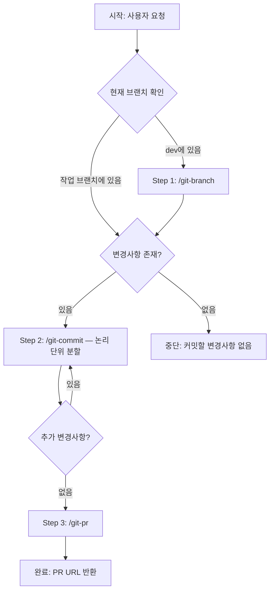

# git-workflow-bcp — Branch · Commit · PR 워크플로

> **B**ranch → **C**ommit → **P**R. Git 작업의 전체 사이클을 한 번에 실행한다.

**범위**: 브랜치 생성 → 변경사항 논리 분할 커밋 → PR 생성/업데이트
**비범위**: 코드 구현, 코드 리뷰, 머지, 워크트리 관리

---

## 흐름도



---

## 실행 로직

### Step 0. 상태 분석 (자동)

```
1. 현재 브랜치 확인 (git branch --show-current)
2. 분기 판단:
   a. dev 또는 main에 있음 → Step 1(branch) 부터 시작
   b. 작업 브랜치에 있음 → Step 1 스킵, Step 2(commit) 부터 시작
   c. 작업 브랜치 + 변경사항 없음 + 커밋 있음 → Step 3(PR) 부터 시작
3. 변경사항 존재 여부 확인 (git status, git diff)
4. 진입점 결정 후 사용자에게 실행 계획 한 줄 보고

예시:
  "dev 브랜치에서 시작합니다. Branch → Commit → PR 순서로 진행합니다."
  "api/feat/coupon-bulk-issue 브랜치에 변경사항이 있습니다. Commit → PR 진행합니다."
```

### Step 1. Branch (/git-branch)

```
1. 사용자 요청에서 작업 내용 추출
2. /git-branch 커맨드 실행:
   - dev에서 최신 pull
   - 작업 타입 판단 (feat/refac/fix)
   - api/{type}/{task-name} 브랜치 생성
3. 결과 보고: "✓ 브랜치 생성: api/{type}/{task-name}"
4. Step 2로 자동 진행
```

### Step 2. Commit (/git-commit — 논리 단위 분할)

```
1. git status + git diff 로 전체 변경사항 수집
2. 변경사항이 없으면 → Step 3으로 스킵

3. 변경사항 분석 & 논리 단위 분할:
   a. 변경된 파일들을 의미 단위로 그룹화:
      - 같은 기능(feature)에 속하는 파일들 → 하나의 커밋
      - 리팩토링 변경 → 별도 커밋
      - 테스트 코드 → 별도 커밋
      - 설정/문서 변경 → 별도 커밋
   b. 각 그룹에 적절한 커밋 타입 결정 (feat/refac/fix/test/docs/chore 등)
   c. 분할 계획 보고:
      "변경사항 분석 완료. 3개 커밋으로 분할합니다:
       1. feat: 쿠폰 일괄 발급 API 구현 (Controller, Service, Repository — 5파일)
       2. test: 쿠폰 발급 서비스 단위 테스트 (2파일)
       3. docs: API 문서 업데이트 (1파일)"

4. 분할 단위별 순차 커밋 실행:
   - 해당 파일들만 git add
   - /git-commit 커맨드의 가드레일 적용 (refac:, 대괄호 금지, AI 정보 금지)
   - pasta-api 모듈 파일 포함 시 spotlessApply 실행
   - 커밋 생성

5. 모든 커밋 완료 후 결과 요약:
   "✓ 3개 커밋 완료:
    [1] feat: 쿠폰 일괄 발급 API 구현
    [2] test: 쿠폰 발급 서비스 단위 테스트
    [3] docs: API 문서 업데이트"

6. Step 3으로 자동 진행
```

### Step 3. PR (/git-pr)

```
1. 원격 push 확인 → 안 되어 있으면 git push -u origin HEAD
2. /git-pr 커맨드 실행:
   - dev 대상 PR 생성 (또는 기존 PR 업데이트)
   - PR_TEMPLATE.md 있으면 적용
   - 커밋 로그 기반 PR 본문 자동 작성
3. 결과 보고: "✓ PR 생성: {PR URL}"
```

---

## 출력 형식

```
git-workflow-bcp 시작
  작업: {작업 설명}
  진입점: {Branch/Commit/PR}부터

Step 1. Branch ... ✓
  api/{type}/{task-name} 생성 완료

Step 2. Commit ... ✓
  변경사항 → {N}개 논리 단위로 분할
  [1] {type}: {요약}
  [2] {type}: {요약}
  ...

Step 3. PR ... ✓
  {PR URL}

git-workflow-bcp 완료
  브랜치: api/{type}/{task-name}
  커밋: {N}개
  PR: {PR URL}
```

---

## 에러 처리

| 실패 지점 | 처리 방식 |
|-----------|-----------|
| Step 1: 브랜치 생성 실패 | 중단 후 원인 보고 (동명 브랜치 존재 등) |
| Step 2: spotless 실패 | spotless 에러 수정 후 재시도 (최대 1회) |
| Step 2: 커밋 충돌 | 중단 후 충돌 내용 보고, 사용자에게 해결 요청 |
| Step 3: push 실패 | 원인 보고 (원격 충돌 등), 사용자에게 해결 요청 |
| Step 3: PR 생성 실패 | gh CLI 에러 보고, 수동 PR 생성 안내 |

---

## 가드레일

### 하드 가드레일 (각 커맨드에서 상속)

1. **커밋 타입**: `refactor:` 아닌 **`refac:`** 사용
2. **대괄호 금지**: `[API]`, `[SHARED]` 등 절대 금지
3. **AI 정보 금지**: Co-authored-by에 claude/AI 관련 정보 포함 금지
4. **base branch**: dev 기반 브랜치 생성, dev 대상 PR
5. **force push 금지**: `--force`, `--no-verify` 등 사용 금지

### 체인 고유 가드레일

6. **빈 커밋 금지**: 변경사항 없으면 커밋 단계 스킵 (빈 커밋 생성 안 함)
7. **분할 최소 원칙**: 1~2개 파일만 변경된 경우 무리하게 분할하지 않음 (단일 커밋 허용)
8. **자동 진행 중 파괴적 명령 금지**: reset --hard, checkout --, clean -f 등 사용 금지

---

## 인자

| 인자 | 필수 | 설명 | 기본값 |
|------|------|------|--------|
| `{작업 설명}` | 필수 | 수행할 작업 내용 (브랜치명 + 커밋/PR에 반영) | - |
| `--skip-branch` | 선택 | 이미 작업 브랜치에 있을 때 Step 1 명시적 스킵 | 자동 감지 |
| `--skip-pr` | 선택 | PR 없이 Branch + Commit만 실행 | - |
| `--single-commit` | 선택 | 논리 분할 없이 단일 커밋으로 처리 | - |

---

## 자기 검증 체크리스트

| # | 항목 |
|---|------|
| 1 | 진입점을 정확히 판단했는가? (dev→Branch, 작업브랜치→Commit) |
| 2 | 변경사항을 논리적 단위로 적절히 분할했는가? |
| 3 | 각 커밋 메시지가 Conventional Commits (refac:, 한국어) 형식인가? |
| 4 | spotless가 필요한 경우 실행했는가? |
| 5 | PR 본문이 커밋 내용을 정확히 반영하는가? |
| 6 | 전체 과정에서 파괴적 명령을 사용하지 않았는가? |
