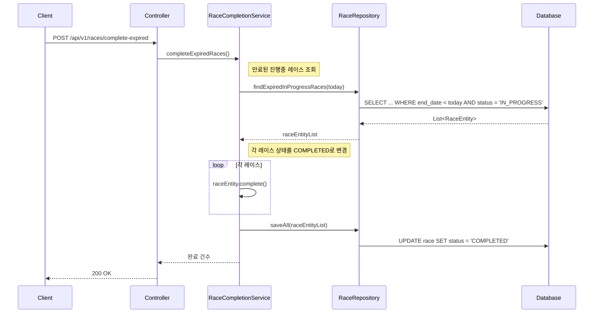
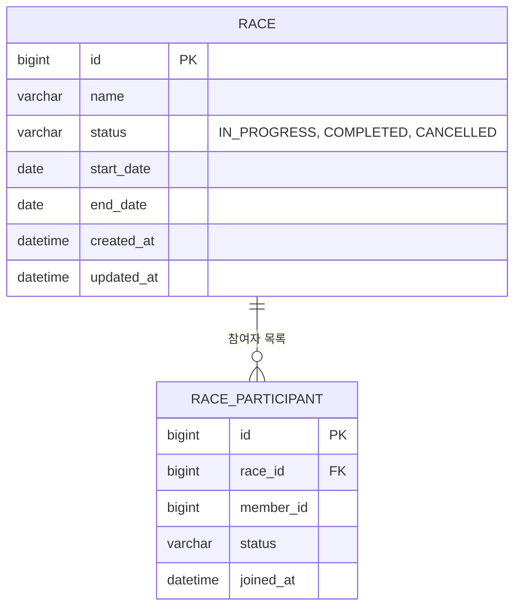
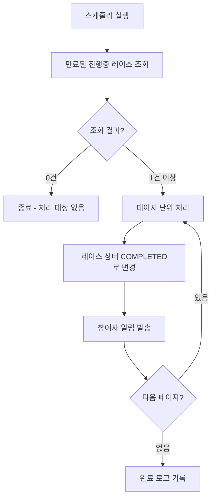

# Mermaid 다이어그램 작성 가이드

TDD 문서에서 사용하는 Mermaid 다이어그램 패턴.

- [시퀀스 다이어그램](#시퀀스-다이어그램)
- [ERD](#erd)
- [플로우차트](#플로우차트)
- [공통 규칙](#공통-규칙)

---

## 시퀀스 다이어그램

API 요청 흐름, 서비스 간 호출에 사용.

---

## ERD

테이블 관계 표현에 사용.

---

## 플로우차트

비즈니스 로직 분기에 사용.

---

## 공통 규칙

1. **한글 Note 주석 필수** — `Note right of Svc: 만료된 진행중 레이스 조회` 형태로 핵심 동작 설명
2. **participant alias 사용** — 긴 이름은 alias로 축약 (`participant Svc as RaceCompletionService`)
3. **DB 쿼리 힌트** — 시퀀스에서 DB 호출 시 실제 SQL 힌트 포함 권장
4. **ERD는 PK/FK/주요 컬럼만** — 모든 컬럼을 넣지 않음, 핵심만
5. **플로우차트 분기에 조건 명시** — `{조회 결과?}` 처럼 판단 기준을 적음
