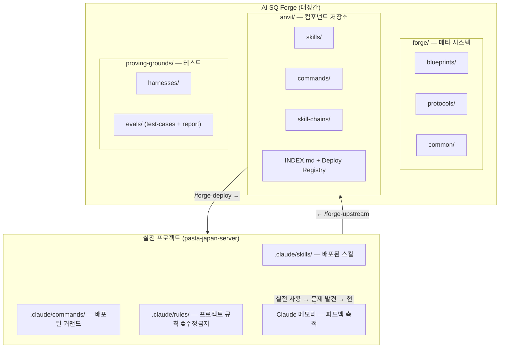
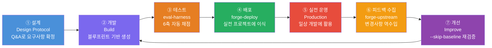
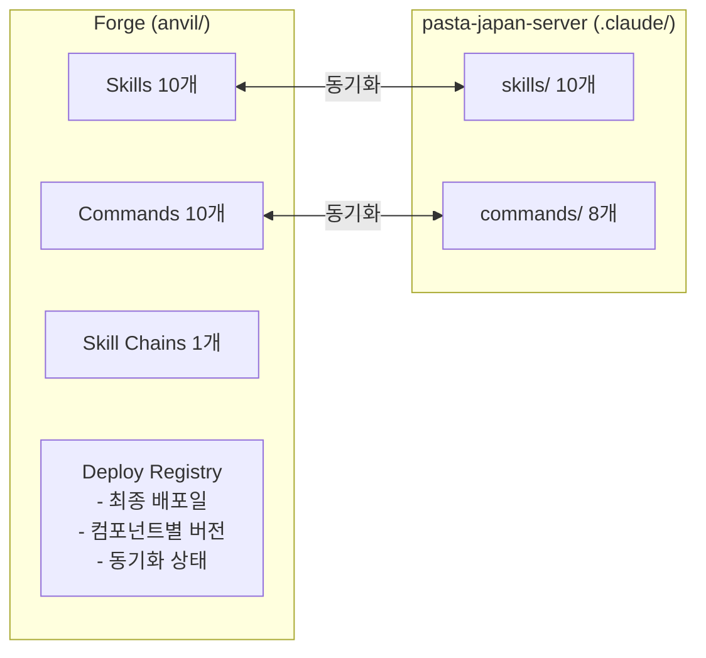
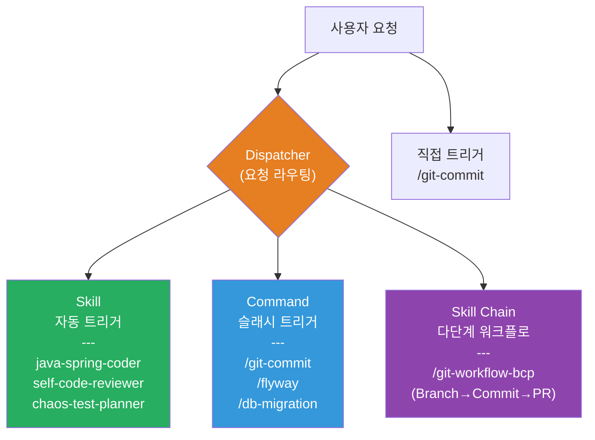
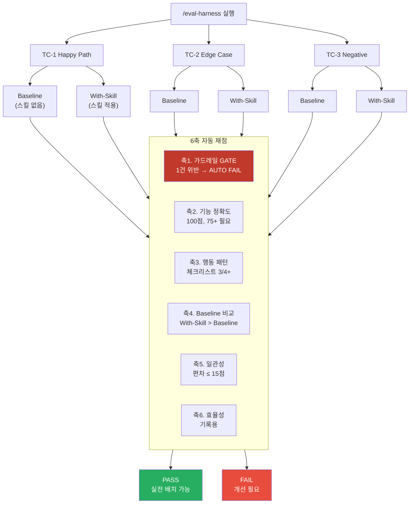
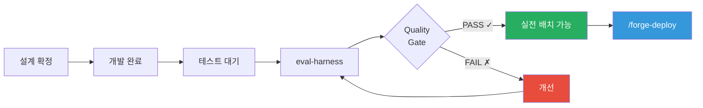
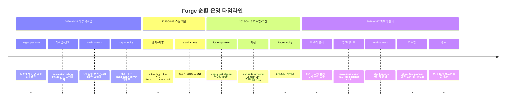

# AI SQ Forge 에코시스템 — 개발·배포·순환 프로세스

## 1. 개요

AI SQ Forge는 Claude Code용 AI 컴포넌트(Skills, Commands, Skill Chains 등)를 **개발 → 테스트 → 배포 → 실전 운영 → 피드백 수집 → 개선**하는 순환 시스템이다.

핵심 아이디어는 **대장간(Forge)과 전장(Production)의 분리**다. Forge에서 컴포넌트를 단련하고, 실전 프로젝트에 배치하고, 실전에서 얻은 교훈을 다시 Forge로 가져와 품질을 높인다.



---

## 2. 두 세계의 역할

### Forge (대장간) — `ai-sq-forge/`

| 영역 | 역할 | 핵심 산출물 |
|------|------|-----------|
| `forge/` | 메타 시스템 — 블루프린트, 프로토콜, 공통 규칙 | 컴포넌트 생성 템플릿, 설계/테스트/A/S 프로토콜 |
| `anvil/` | 컴포넌트 저장소 — Skills, Commands, Chains | SKILL.md, evaluation-rubric.md, INDEX.md |
| `proving-grounds/` | 테스트 영역 — 하네스, 평가, 리포트 | harness.md, test-cases.md, report.md |
| `maintenance/` | A/S 영역 — 실전 피드백 기록 | feedback 이력 |

### Production (전장) — 예: `pasta-japan-server/`

| 영역 | 역할 |
|------|------|
| `.claude/skills/` | 배포된 스킬이 실전 코딩 작업에 활용됨 |
| `.claude/commands/` | 슬래시 커맨드로 git/DB 작업 자동화 |
| `.claude/rules/` | 프로젝트 코딩 규칙 (forge에서 참조만, 수정 금지) |
| Claude 메모리 | 사용 중 발견된 문제/교훈이 피드백으로 축적 |

---

## 3. 순환 라이프사이클



### 각 단계 상세

#### ① 설계 (Design Protocol)

```
트리거: 사용자 요청 "~~ 스킬 만들어줘"
실행: forge/protocols/design.md
프로세스:
  Phase 1. 의도 파악 (What & Why) — Q&A
  Phase 2. 경계 설정 (Scope & Guardrails)
  Phase 3. 레퍼런스 수집
  Phase 4. 초안 작성 & 확인
산출물: 요구사항 확정, 컴포넌트 유형 결정
```

#### ② 개발 (Build)

```
입력: 확정된 요구사항 + 블루프린트 템플릿
실행: forge/blueprints/{type}.blueprint.md 기반
프로세스:
  1. 블루프린트 로드 → SKILL.md 초안 작성
  2. references/ 분리 (400줄 초과 시)
  3. evaluation-rubric.md 작성 (100점 채점 기준 + AUTO FAIL)
  4. anvil/INDEX.md 등록 (상태: "테스트 대기")
산출물: anvil/{type}/{name}/ 컴포넌트 일체
```

#### ③ 테스트 (eval-harness)

```
커맨드: /eval-harness {name}
프로세스:
  1. harness.md + test-cases.md 작성
  2. TC별 baseline(스킬 없음) + with-skill(스킬 적용) 서브에이전트 병렬 실행
  3. 6축 자동 채점:
     축 1. 가드레일 준수 (GATE — 1건이라도 위반 시 AUTO FAIL)
     축 2. 기능 정확도 (100점 만점)
     축 3. 행동 패턴 (체크리스트)
     축 4. Baseline 대비 개선도
     축 5. 일관성 (--repeat 3 시)
     축 6. 효율성 (기록용)
  4. Quality Gate 통과 → "실전 배치 가능"
산출물: proving-grounds/evals/{name}/report.md
```

#### ④ 배포 (forge-deploy)

```
커맨드: /forge-deploy {프로젝트 경로}
프로세스:
  Phase 0. 사전 검증 (프로젝트 존재, .claude/ 확인)
  Phase 1. 이식 대상 선정 (실전 배치 가능 컴포넌트만)
  Phase 2. 충돌 분석 (기존 컴포넌트와 대체/신규 분류)
  Phase 3. 경로 리매핑 (forge 경로 → .claude/ 경로)
  Phase 4. 백업 (forge/backup/{date}/)
  Phase 5. 이식 실행 (frontmatter에서 version/changelog 제거)
  Phase 6. 리포트 + Deploy Registry 업데이트
산출물: 실전 프로젝트 .claude/에 컴포넌트 배치
```

#### ⑤ 실전 운영

```
환경: 실전 프로젝트에서 일상 개발 작업에 활용
과정:
  - 스킬이 코딩/리뷰/문서 작성 등에 자동 트리거
  - 사용 중 문제 발견 → 현장에서 즉시 수정
  - Claude 메모리에 피드백 축적 (feedback_*.md)
  - 실전에서 신규 스킬 생성되기도 함 (skill-creator 활용)
```

#### ⑥ 피드백 수집 — 역수입 (forge-upstream)

```
커맨드: /forge-upstream [--with-feedback]
프로세스:
  Phase 0. Deploy Registry에서 연결된 프로젝트 탐색
  Phase 1. 변경 감지 (forge ↔ 실전 diff)
  Phase 2. 변경 내용 상세 확인 (사용자 승인)
  Phase 3. forge 반영 (백업 후 복사)
  Phase 3.5. 피드백 기록 (--with-feedback 시)
  Phase 4. 리포트
추가: Claude 메모리(feedback_*.md) 분석 → 스킬 갭 도출
산출물: forge 원본에 실전 개선사항 반영
```

#### ⑦ 개선 (Improve)

```
커맨드: /eval-harness {name} --skip-baseline
프로세스:
  1. 역수입된 변경사항 또는 피드백 기반 스킬 수정
  2. --skip-baseline으로 빠른 재검증
  3. Quality Gate 재통과 확인
  4. INDEX.md 버전 업데이트
  5. → ④ 재배포로 순환
```

---

## 4. Deploy Registry — 연결 관리

anvil/INDEX.md 하단의 Deploy Registry가 forge와 실전 프로젝트 간 연결을 추적한다.



### 동기화 상태 유형

| 상태 | 의미 | 발생 조건 |
|------|------|----------|
| 동기화 | forge = 실전 | 배포 직후, 역수입 직후 |
| forge 최신 | forge > 실전 | forge에서 개선 후 미배포 |
| 실전 최신 | forge < 실전 | 실전에서 수정 후 미역수입 |
| 실전만 | forge에 없음 | 실전에서 신규 생성 |

---

## 5. 컴포넌트 유형별 역할



---

## 6. 품질 보증 체계

### 6축 자동 채점 시스템



### 품질 게이트 흐름



---

## 7. 실전 사례: 전체 순환 흐름

아래는 실제 운영에서 발생한 순환 사례다.



---

## 8. 현재 상태 요약

### 컴포넌트 현황 (2026-04-17 기준)

| 유형 | 수량 | 실전 배치 가능 | 배포 대상 |
|------|------|-------------|----------|
| Skills | 10개 | 10/10 (100%) | pasta-japan-server |
| Commands | 10개 | 8개 배포 + 2개 forge 전용 | pasta-japan-server |
| Skill Chains | 1개 | 1/1 (100%) | 미배포 (forge 전용) |
| Agents | 0개 | - | - |

### 연결된 프로젝트

| 프로젝트 | 컴포넌트 | 최종 배포 | 상태 |
|---------|---------|----------|------|
| pasta-japan-server | 18개 | 2026-04-17 | 전원 동기화 |

### 핵심 커맨드

| 커맨드 | 방향 | 용도 |
|--------|------|------|
| `/forge-deploy` | Forge → 실전 | 컴포넌트 배포 |
| `/forge-upstream` | 실전 → Forge | 변경사항 역수입 |
| `/eval-harness` | Forge 내부 | 6축 자동 품질 평가 |
