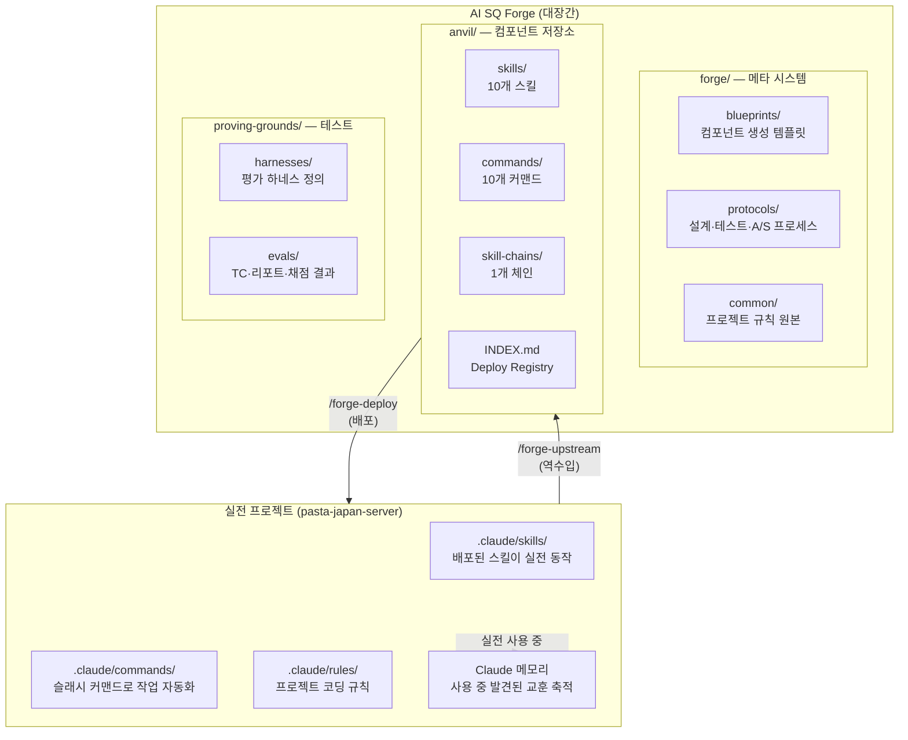
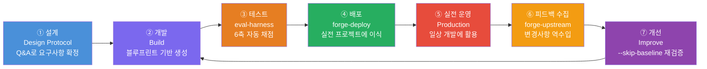
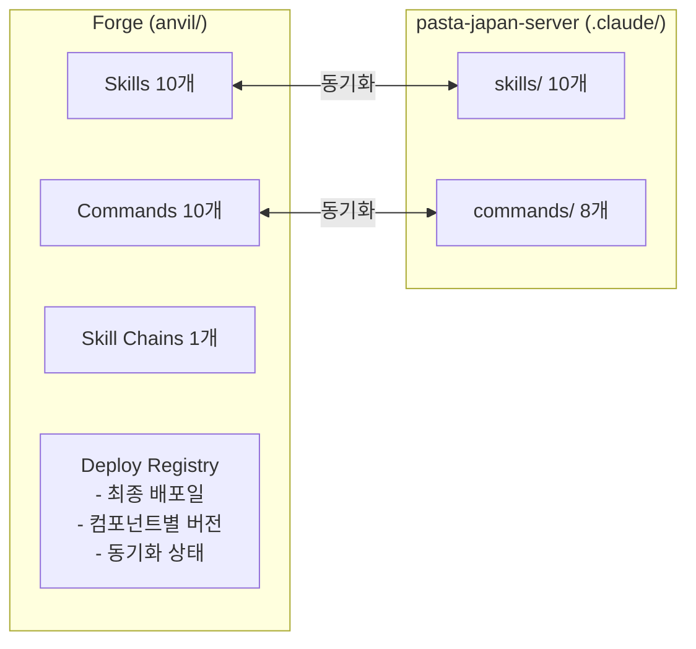
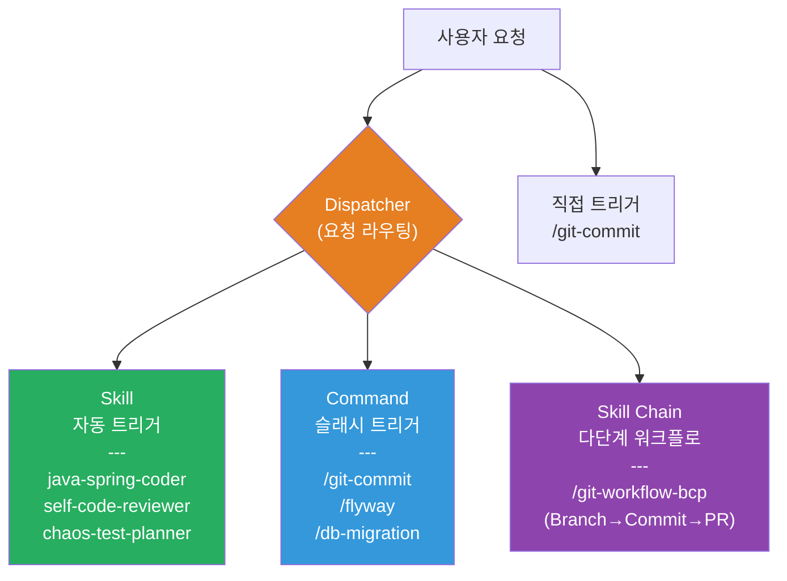
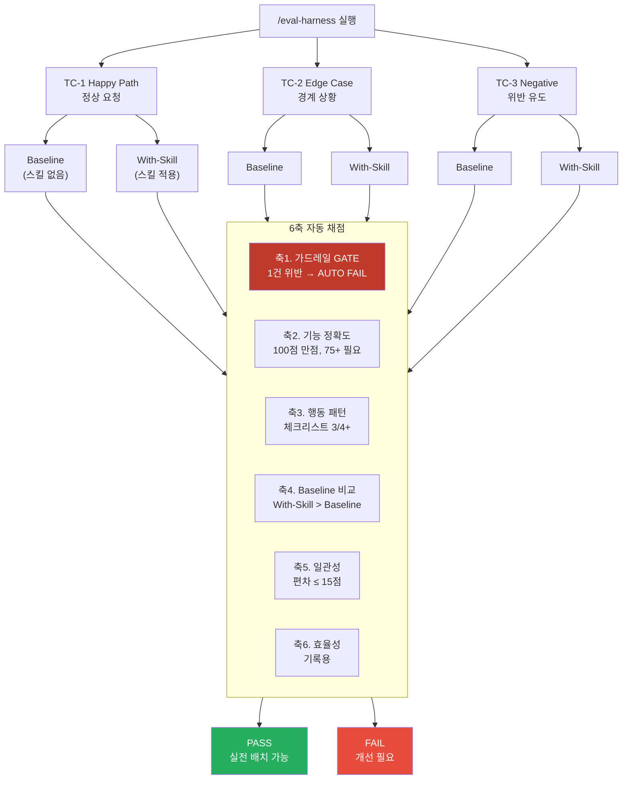
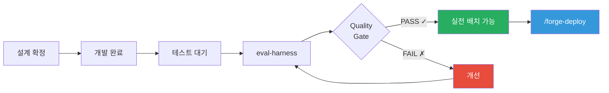
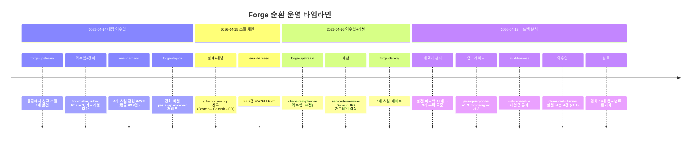

# AI SQ Forge 에코시스템 — 개발·배포·순환 프로세스

## 1. 개요: 왜 이런 시스템이 필요한가?

Claude Code에게 "코드 작성해줘"라고 하면 알아서 해주지만, **팀의 규칙과 관례를 매번 설명하는 건 비효율적**이다. 스킬(Skill)을 만들어 규칙을 내장하면 Claude가 처음부터 우리 방식대로 일한다.

그런데 스킬을 만들고 나면 새로운 문제가 생긴다:
- 스킬이 제대로 동작하는지 **어떻게 검증**하지?
- 실전에서 문제가 발견되면 **어떻게 개선**하지?
- 여러 프로젝트에서 같은 스킬을 쓰는데 **어떻게 동기화**하지?

**AI SQ Forge**는 이 문제를 해결하는 순환 시스템이다. 비유하자면:

> **대장간(Forge)**에서 무기를 단련하고 → **전장(Production)**에 보내고 → 전장에서 칼날이 이가 나면 → 다시 대장간으로 가져와 벼린다.

### 핵심 원칙 3가지

1. **Forge에서 만들고, Production에서 쓴다** — 개발/테스트 환경과 실전 환경을 분리하여 안전하게 운영
2. **테스트 없이 배포하지 않는다** — 6축 자동 채점(eval-harness)을 통과해야만 실전 배치 가능
3. **실전 피드백은 반드시 Forge로 돌아온다** — 실전에서 쌓인 교훈을 역수입하여 스킬을 지속 개선

---

## 2. 두 세계의 역할

### Forge (대장간) — `ai-sq-forge/`

Forge는 4개 영역으로 구성된다. 각 영역이 뚜렷한 역할을 맡는다.

| 영역 | 비유 | 역할 | 핵심 산출물 |
|------|------|------|-----------|
| `forge/` | 설계도면실 | 메타 시스템 — "어떻게 만들 것인가"의 기준 | 블루프린트 템플릿, 설계/테스트/A/S 프로토콜 |
| `anvil/` | 무기 보관소 | 컴포넌트 저장소 — 만들어진 스킬/커맨드의 원본 | SKILL.md, evaluation-rubric.md, INDEX.md |
| `proving-grounds/` | 시험장 | 테스트 영역 — 실전에 내보내도 되는지 검증 | harness.md, test-cases.md, report.md |
| `maintenance/` | 수리 공방 | A/S 영역 — 실전에서 돌아온 피드백 기록 | feedback 이력 |

### Production (전장) — 예: `pasta-japan-server/`

실전 프로젝트의 `.claude/` 디렉토리에 배포된 컴포넌트가 위치한다.

| 영역 | 역할 | 비고 |
|------|------|------|
| `.claude/skills/` | 배포된 스킬이 코딩/리뷰/문서 작성에 **자동 트리거**됨 | Claude Code가 description 키워드로 매칭 |
| `.claude/commands/` | `/git-commit` 같은 슬래시 커맨드로 **명시적 실행** | 파일명 = 트리거명 |
| `.claude/rules/` | 프로젝트 코딩 규칙 — 스킬이 참조함 | forge에서 **절대 수정하지 않음** |
| Claude 메모리 | 사용 중 교훈이 `feedback_*.md`로 축적 | forge-upstream 시 분석 대상 |

---

## 3. 순환 라이프사이클: 7단계

스킬의 일생은 7단계로 순환한다. ⑦에서 다시 ②로 돌아가는 것이 핵심이다.

### 각 단계 상세

#### ① 설계 (Design Protocol)

**"만들기 전에 물어본다."** 즉시 구현하지 않고, 사용자와 Q&A를 통해 요구사항을 확정한다.

- **트리거**: 사용자가 "~~ 스킬 만들어줘"라고 요청
- **프로토콜**: `forge/protocols/design.md`
- **핵심 질문**: 무엇을 자동화하려는가? / 어떤 유형(Skill/Command/Chain)이 적합한가? / 트리거 조건은? / 예상 출력물은?
- **산출물**: 요구사항 확정 문서, 컴포넌트 유형 결정

#### ② 개발 (Build)

**"템플릿에 맞춰 만든다."** 유형별 블루프린트를 기반으로 일관된 품질의 컴포넌트를 생성한다.

- **입력**: 확정된 요구사항 + `forge/blueprints/{type}.blueprint.md`
- **프로세스**: SKILL.md 작성 → references/ 분리(400줄 초과 시) → evaluation-rubric.md 작성(100점 채점 기준) → INDEX.md 등록
- **산출물**: `anvil/{type}/{name}/` 하위 컴포넌트 일체
- **상태**: INDEX.md에 **"테스트 대기"**로 등록

#### ③ 테스트 (eval-harness)

**"스킬 있을 때 vs 없을 때를 비교한다."** baseline(스킬 없이)과 with-skill(스킬 적용)을 동일 프롬프트로 실행하여 객관적으로 비교 채점한다.

- **커맨드**: `/eval-harness {name}`
- **테스트 케이스**: Happy Path(정상) + Edge Case(경계) + Negative(위반 유도) 최소 3개
- **채점**: 6축 자동 채점 (아래 "6. 품질 보증 체계" 참조)
- **통과 기준**: Happy Path 75점+, 가드레일 위반 0건, Baseline 대비 개선 확인
- **산출물**: `proving-grounds/evals/{name}/report.md`
- **상태 변경**: 통과 시 INDEX.md **"실전 배치 가능"**으로 업데이트

#### ④ 배포 (forge-deploy)

**"안전하게 이식한다."** Forge의 컴포넌트를 실전 프로젝트의 `.claude/`에 복사한다. 단순 복사가 아니라 충돌 분석, 백업, 경로 변환을 자동 수행한다.

- **커맨드**: `/forge-deploy {프로젝트 경로}`
- **안전장치**: 이식 전 기존 버전 백업 → 충돌 분석 → 사용자 확인 → 이식 → Deploy Registry 업데이트
- **경로 변환**: forge 내부 경로를 `.claude/` 경로로 자동 리매핑. `version/changelog` 등 forge 전용 frontmatter는 제거
- **산출물**: 실전 프로젝트 `.claude/`에 컴포넌트 배치 + Deploy Registry 업데이트

#### ⑤ 실전 운영

**"실전에서 부딪히며 단련된다."** 배포된 스킬이 일상 개발에 사용되면서 예상치 못한 상황을 만난다.

- **환경**: 실전 프로젝트에서 일상 코딩, 리뷰, 문서 작성, 테스트 등
- **자동 트리거**: Claude Code가 SKILL.md의 description 키워드를 매칭하여 적절한 스킬을 자동 적용
- **피드백 축적**: 사용 중 발견된 문제/교훈이 Claude 메모리(`feedback_*.md`)에 축적
- **현장 수정**: 급한 문제는 실전에서 직접 수정하기도 함 (이후 역수입 대상)
- **신규 생성**: `skill-creator` 등을 활용하여 실전에서 새 스킬을 만들기도 함

#### ⑥ 피드백 수집 — 역수입 (forge-upstream)

**"전장의 교훈을 대장간으로 가져온다."** 실전에서 개선된 스킬, 새로 만든 스킬, 축적된 피드백 메모리를 Forge로 역수입한다.

- **커맨드**: `/forge-upstream [--with-feedback]`
- **프로세스**: Deploy Registry에서 연결 프로젝트 탐색 → forge ↔ 실전 diff 비교 → 변경 내용 사용자 확인 → forge 원본에 반영
- **피드백 분석**: Claude 메모리의 `feedback_*.md` 파일을 읽어 스킬에 누락된 규칙(갭)을 도출
- **산출물**: forge 원본에 실전 개선사항 반영 + 갭 분석 결과

#### ⑦ 개선 (Improve)

**"갈고 닦아서 다시 내보낸다."** 역수입된 변경사항이나 피드백 분석 결과를 반영하여 스킬을 개선하고, 빠르게 재검증한다.

- **커맨드**: `/eval-harness {name} --skip-baseline` (이전 baseline 결과 재사용)
- **프로세스**: 스킬 수정 → --skip-baseline으로 빠른 재검증 → Quality Gate 재통과 → INDEX.md 버전 업데이트
- **순환**: 재검증 통과 후 → ④ 재배포로 순환 완성

---

## 4. Deploy Registry — 누가 어디에 배포되었는가?

`anvil/INDEX.md` 하단의 **Deploy Registry**가 forge와 실전 프로젝트 사이의 연결을 추적한다. "어떤 스킬이 어떤 프로젝트에 몇 버전으로 배포되었는가"를 한눈에 파악할 수 있다.

### 동기화 상태 유형

동기화 상태는 4가지로 분류된다. `/forge-deploy --sync`를 실행하면 전체 상태를 한번에 점검할 수 있다.

| 상태 | 의미 | 발생 조건 | 필요 조치 |
|------|------|----------|----------|
| **동기화** | forge = 실전, 동일 | 배포 직후 또는 역수입 직후 | 없음 |
| **forge 최신** | forge에서 개선했으나 미배포 | forge에서 스킬 수정 후 /forge-deploy 안 함 | `/forge-deploy` 실행 |
| **실전 최신** | 실전에서 수정했으나 미역수입 | 실전에서 현장 수정 후 /forge-upstream 안 함 | `/forge-upstream` 실행 |
| **실전만** | forge에 없는 스킬 | 실전에서 skill-creator로 신규 생성 | `/forge-upstream`으로 역수입 |

---

## 5. 컴포넌트 유형: Skill vs Command vs Chain

Claude Code에서 동작하는 컴포넌트는 3가지 유형이 있다. 각각 **트리거 방식**과 **복잡도**가 다르다.

| 유형 | 트리거 | 복잡도 | 예시 | 적합한 상황 |
|------|--------|--------|------|-----------|
| **Skill** | 자동 (description 키워드 매칭) | 중~높음 | java-spring-coder, self-code-reviewer | 복잡한 규칙이 많고, 자동으로 적용되어야 할 때 |
| **Command** | 명시적 (`/커맨드명`) | 낮음 | /git-commit, /flyway | 빠른 단일 작업, 사용자가 의도적으로 실행할 때 |
| **Skill Chain** | 명시적 (`/체인명`) | 높음 | /git-workflow-bcp | 여러 커맨드/스킬을 순서대로 엮어야 할 때 |

---

## 6. 품질 보증 체계: 6축 자동 채점

**"스킬이 있을 때 정말 더 나은가?"**를 객관적으로 측정하는 시스템이다. 동일한 프롬프트에 대해 스킬 없이(Baseline) vs 스킬 적용(With-Skill)으로 두 번 실행하고, 6가지 축으로 비교 채점한다.

### 6축 설명

| 축 | 이름 | 질문 | 통과 기준 |
|----|------|------|----------|
| 1 | **가드레일** | 절대 하면 안 되는 것을 했는가? | 위반 0건 (1건이라도 → AUTO FAIL) |
| 2 | **기능 정확도** | 요청한 대로 정확히 수행했는가? | 100점 만점 중 75점 이상 |
| 3 | **행동 패턴** | 올바른 순서와 절차를 밟았는가? | 체크리스트 항목 75% 이상 충족 |
| 4 | **Baseline 비교** | 스킬 없을 때보다 정말 나은가? | With-Skill 점수 > Baseline 점수 |
| 5 | **일관성** | 매번 비슷한 품질을 내는가? | 편차 15점 이내 (--repeat 3 시) |
| 6 | **효율성** | 얼마나 빠르고 적은 비용으로 하는가? | 기록용 (합격 조건 아님) |

### 품질 게이트 흐름

Quality Gate를 통과하지 못한 컴포넌트는 실전에 배포할 수 없다. 개선 후 재테스트하여 통과해야만 배포 가능하다. 이미 배포된 스킬을 개선할 때는 `--skip-baseline` 옵션으로 이전 baseline 결과를 재사용하여 빠르게 재검증한다.

---

## 7. 실전 사례: 전체 순환 흐름

아래는 2026년 4월 14일부터 17일까지 실제로 발생한 순환 사례다. Forge 시스템이 어떻게 동작하는지 구체적으로 보여준다.

### 사례별 해설

**4/14 — 대량 역수입**: 실전 프로젝트에서 자연스럽게 만들어진 스킬 6개를 발견. Forge로 가져와서 forge 품질 기준(frontmatter, evaluation-rubric, Phase 0 사전확인, 가드레일)으로 강화한 뒤, eval-harness로 검증(평균 90.8점). 강화된 버전을 다시 실전에 재배포하여 **원본보다 더 나은 버전**이 실전에 돌아감.

**4/15 — 스킬 체인 신규**: 실전에서 반복되는 패턴(브랜치 생성 → 커밋 → PR)을 발견하여 3개 커맨드를 하나의 체인으로 엮음. 92.7점 EXCELLENT.

**4/16 — 역수입 + 개선**: 실전에서 만들어진 chaos-test-planner를 역수입하고, eval 리포트에서 도출된 개선점(self-code-reviewer의 Domain JPA 우선순위 격상)을 반영. **eval 결과가 개선의 근거**가 된 사례.

**4/17 — 피드백 메모리 분석**: 실전 프로젝트의 Claude 메모리(feedback_*.md 15개)를 분석하여, 스킬에 아직 반영되지 않은 규칙 3개를 도출. 스킬 업그레이드 후 `--skip-baseline`으로 빠르게 재검증. chaos-test-planner는 실전에서 장애를 겪으며 교훈 4건이 추가되어 역수입. **실전 경험이 스킬을 더 강하게 만든 사례**.

---

## 8. 현재 상태 요약

### 컴포넌트 현황 (2026-04-17 기준)

| 유형 | 수량 | 실전 배치 가능 | 배포 대상 | 비고 |
|------|------|-------------|----------|------|
| Skills | 10개 | 10/10 (100%) | pasta-japan-server | 평균 점수 93.4점 |
| Commands | 10개 | 8개 배포 + 2개 forge 전용 | pasta-japan-server | forge 전용: eval-harness, forge-deploy |
| Skill Chains | 1개 | 1/1 (100%) | forge 전용 | git-workflow-bcp (92.7점) |
| Agents | 0개 | - | - | 향후 확장 가능 |

### 연결된 프로젝트

| 프로젝트 | 배포된 컴포넌트 | 최종 배포 | 상태 |
|---------|--------------|----------|------|
| pasta-japan-server | 18개 (스킬 10 + 커맨드 8) | 2026-04-17 | 전원 동기화 |

### 핵심 커맨드 요약

| 커맨드 | 방향 | 한 줄 설명 |
|--------|------|-----------|
| `/forge-deploy` | Forge → 실전 | 테스트 통과한 컴포넌트를 실전 프로젝트에 안전하게 이식 |
| `/forge-upstream` | 실전 → Forge | 실전에서 개선/생성된 컴포넌트를 Forge로 역수입 |
| `/eval-harness` | Forge 내부 | baseline vs with-skill 비교로 6축 자동 품질 평가 |
| `/forge-deploy --sync` | 점검 | 연결된 모든 프로젝트의 동기화 상태 일괄 확인 |
