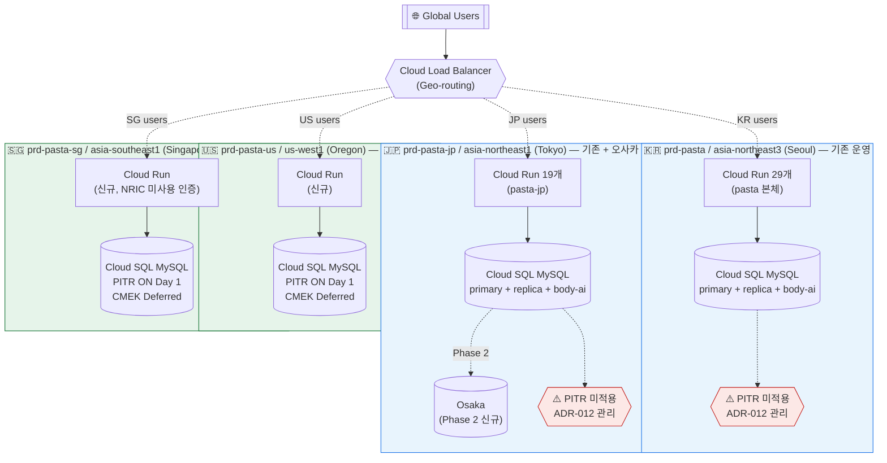
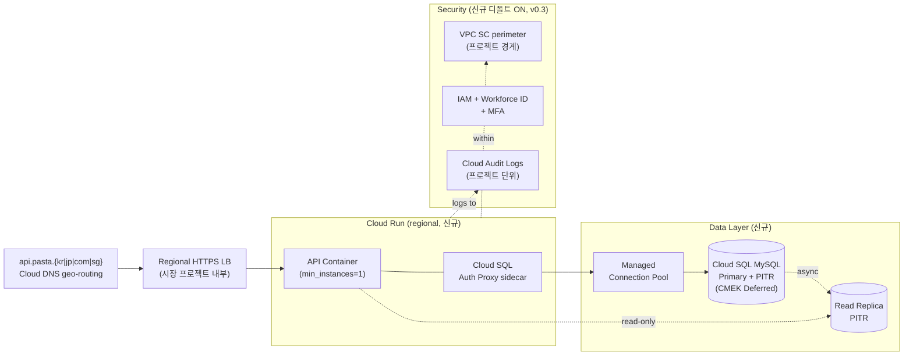

# pasta 글로벌 확장 인프라 설계안 (v0.3 통합)

- **작성일**: 2026-04-22 (v0.3 갱신: 2026-05-08)
- **버전**: v0.3 (Draft, 후속 결정 5건 반영)
- **작성**: slicequeue (+ `gcp-infra-architect v1.2` 에이전트 파트너)
- **관련**: [README.md](README.md) · [CONTEXT.md](CONTEXT.md) · [ROADMAP-EFFORT.md](ROADMAP-EFFORT.md) · [GKE-IMMEDIATE-ADOPTION.md](GKE-IMMEDIATE-ADOPTION.md) · [adr/](adr/)

---

## v0.3 변경 요약 (2026-05-08)

| 영역 | v0.2 | v0.3 |
|------|------|------|
| **CMEK** | 신규 리전 Day 1 ON / 기존 ADR-012 데드라인 | **Deferred** (ADR-006), Phase 3+ 적용. PITR만 데드라인 유지 |
| **프로젝트 분할** | 명시 결정 없음 (사실상 시장별 운영 중) | **Option B 명시 결정**: 시장(국가)별 프로젝트 + 시장 내 멀티 리전 (ADR-013 신설) |
| **로드밸런서 패턴** | "Global LB geo-routing" 추상 표기 | **Pattern 2 default**: 시장별 LB + DNS geo (ADR-014 신설). Pattern 1은 향후 옵션 |
| **작업 견적·MVP** | Phase별 일정만 | **Realistic 12~14개월 / 9개월 MVP / 5개월 MVP-Lite** 견적 추가 (ROADMAP-EFFORT.md) |
| **GKE 즉시 도입** | Phase 3 하이브리드 재평가 | 별도 시나리오 문서로 분석 후 **즉시 도입 비권고** (GKE-IMMEDIATE-ADOPTION.md) |

---

## §1. 경영진 요약 (1페이지)

### 배경 (v0.2 재정립)

pasta는 현재 **한국(pasta, `asia-northeast3` 서울, Cloud Run 29개)과 일본(pasta-jp, `asia-northeast1` 도쿄, Cloud Run 19개)에서 독립 레포로 운영 중**이다. 신규 **글로벌 통합 레포**로 코드베이스를 정리하고, **미국과 싱가포르 리전을 추가**하는 것이 목표다. 헬스케어 도메인 특성상 **4개국 규제**(HIPAA / 개보법 / 3省2ガイドライン / PDPA)를 모두 준수해야 한다.

추가로 **현재 운영에 CMEK/PITR 보안 gap이 있음**이 확인됐다. 인프라·보안팀 협의와 예산 결재가 필요해 즉시 해결은 어려우나, **완화책 4종 적용 + 데드라인 설정**으로 관리한다 (ADR-012).

### 핵심 권고 (v0.3 갱신)

1. **컴퓨트**: Cloud Run 유지(신규 리전 동일) + Phase 3에서 Kafka 도입 시 GKE Autopilot 하이브리드 재평가. **GKE 즉시 도입은 비권고** (GKE-IMMEDIATE-ADOPTION.md 참조)
2. **DB**: **리전별 Cloud SQL MySQL HA** (현행 엔진 유지) — Spanner/Postgres 불채택
3. **리전**: 🇰🇷 서울(기존) + 🇯🇵 도쿄(기존)+오사카 DR(신규) + 🇺🇸 오레곤(신규) + 🇸🇬 싱가포르(신규)
4. **🆕 프로젝트 분할 (ADR-013)**: **시장(국가)별 GCP 프로젝트 + 시장 내 멀티 리전 허용** (Option B). `prd-pasta-{kr|jp|us|sg}`
5. **🆕 LB 패턴 (ADR-014)**: **Pattern 2 default** — 시장별 LB + DNS geo-routing. 호스트 프로젝트 글로벌 LB(Pattern 1)는 향후 옵션
6. **IaC**: **Terraform green-field 도입** (현재 미사용) — `environments/prd/{project}/{region}/` 2단계 매트릭스 (ADR-005 보정)
7. **보안 디폴트 ON (신규 리전부터)**: VPC SC + Audit Log + MFA + Org Policy + **PITR**. **CMEK는 Deferred** (ADR-006, Phase 3+ 적용)

### 주요 리스크 & 완화

| 리스크 | 영향 | 완화 |
|-------|-----|------|
| 🆕 **기존 CMEK/PITR gap** | 감사 지적, 사고 시 24h 데이터 손실 | **ADR-012 Accepted Risk + 완화책 4종 + 마이그 시점 해결 데드라인** |
| 🆕 **글로벌 레포 전략 미확정** | 코드베이스 통합 방식 리스크 | **ADR-011 3시나리오 병기, 공통 기반 먼저 구축** |
| 🆕 **48개 서비스 통합 범위** | 마이그레이션 부담 | Phase별 분할, 핵심 서비스부터 단계적 |
| 기존 MySQL → 새 리전 확장 | 스키마 drift | **Flyway 통일 마이그레이션** + CI 검증 |
| 미국 HIPAA BAA 지연 | Phase 2 지연 | Phase 0에 BAA 신청 선행 |
| Cloud Run 안정성 재발 | 고객 이탈 | Managed Pooling + Auth Proxy Sidecar (신규부터) |
| 4개국 규제 불일치 | 감사 실패 | 리전별 체크리스트 dry-run |

### 일정 & 마일스톤 (v0.3 갱신)

> **상세 견적·시나리오는 [ROADMAP-EFFORT.md](ROADMAP-EFFORT.md) 참조** — Realistic 12~14개월 / 9개월 MVP / 5개월 MVP-Lite

| Phase | 기간 (원안) | 주요 산출 | 검증 |
|-------|------|----------|------|
| **0. 현황 진단 + 완화책** | 2026-04~05 | ADR-012 완화책 4종 적용 / 미국 BAA / **Q1(글로벌 레포) 확정** | Audit Log 가동, Q1 팀 합의 |
| **1. 공통 기반 구축** | 2026-05~07 | Terraform 모듈 v1 (`environments/prd/{project}/{region}/` 매트릭스) / Org Policy / VPC SC | 리전 제한 강제 검증 |
| **2. 리전 확장** | 2026-07~10 | 미국 리전 신규 + 싱가포르 신규 + 일본 오사카 DR + LB Pattern 2 + DNS geo | 4개국 규제 감사 dry-run |
| **3. 통합·최적화** | 2026-10~12 | Q1 시나리오 따라 기존 한·일 코드 통합 / **PITR 도입(ADR-012)** / 최적화 / GKE 재평가 / **CMEK 도입 검토(ADR-006)** | SLO 검증, DR 훈련 |

> ⚠️ **현실 견적**: 위 9개월은 Best case. 1인+부분 지원 기준 Realistic은 12~14개월. ROADMAP-EFFORT.md §1 참조.

### 비용 관점 (정밀 견적 아님)

- Phase 0~1 (공통 기반): 현 비용 + 완화책 미미 → **+5~10%**
- Phase 2 (미·싱 신규): 리전 2개 신설 → **+40~60%** (scale-to-zero 완충)
- Phase 3 (통합·최적화): 재편 효과로 **증가폭 둔화**
- 예산 억 단위 여유 범위 내 수용 가능

---

## §2. 아키텍처 다이어그램 (Mermaid)

### 2-1. 글로벌 개요 (Regional Silo + Global LB)



**v0.3 핵심 변경**: 시장별 GCP 프로젝트 명시(ADR-013), LB Pattern 2 전제, **CMEK Deferred (PITR만 gap 표시)**.

### 2-2. 단일 리전 내부 (신규 리전 Phase 2 기준, v0.3)

신규 리전(미·싱)은 **시장 프로젝트 내부에 완결 구조**로 구축. LB Pattern 2:



기존 리전(한·일)은 **ADR-012 PITR 완화책 적용 + 마이그레이션 시점에 동일 구조로 전환**. **CMEK는 Phase 3+에서 검토 (ADR-006 Deferred)**.

---

## §3. 핵심 결정 (ADR 요약, v0.3)

| ADR | 주제 | 결정 | 상태 |
|-----|------|------|------|
| [001](adr/ADR-001-compute-strategy.md) | 컴퓨트 | Cloud Run 유지 + Phase 3 하이브리드 GKE 재평가 (즉시 도입 비권고) | Proposed |
| [002](adr/ADR-002-database-strategy.md) | DB | 리전별 Cloud SQL MySQL HA | Proposed |
| [003](adr/ADR-003-region-routing.md) | 리전 | 한+일 기존 + 미+싱 신규 + 오사카 DR | Proposed |
| [004](adr/ADR-004-data-residency.md) | 레지던시 | 민감정보 silo + 비민감 메타 공유 | Proposed |
| [005](adr/ADR-005-terraform-structure.md) | TF | green-field 신규 도입 + **2단계 매트릭스 보정 필요** (v0.3) | Proposed |
| [**006**](adr/ADR-006-cmek-key-management.md) | CMEK | 리전별 keyring + 목적별 key — **Deferred (v0.3, Phase 3+)** | **Deferred** |
| [011](adr/ADR-011-global-repo-strategy.md) | 글로벌 레포 | 3시나리오 병기, 팀 논의 중 | Proposed |
| [012](adr/ADR-012-cmek-pitr-accepted-risk.md) | 수용 리스크 | **PITR**만 데드라인 유지 (v0.3 스코프 축소) | Accepted |
| [**🆕 013**](adr/ADR-013-project-partitioning-strategy.md) | **프로젝트 분할** | **Option B: 시장별 프로젝트 + 시장 내 멀티 리전** | Proposed |
| [**🆕 014**](adr/ADR-014-load-balancer-pattern.md) | **LB 패턴** | **Pattern 2 default: 시장별 LB + DNS geo** | Proposed |

---

## §4. Terraform 구조 + 핵심 스니펫 (**참조용, 실행 금지**)

### 디렉토리 트리 (green-field 신규, v0.3 보정 — ADR-013 시장별 프로젝트 반영)

```
pasta-global-infra/                   # 신규 레포 (가칭)
├── modules/
│   ├── cloud-run-service/            # Cloud Run + Auth Proxy sidecar
│   ├── cloud-sql-mysql-regional/     # MySQL HA + PITR (CMEK는 옵셔널, v0.3 Deferred)
│   ├── vpc-network-regional/
│   ├── kms-cmek/                     # Phase 3+ 활성화 (ADR-006 Deferred)
│   ├── iam-baseline/
│   ├── loadbalancer-regional/        # 🆕 LB Pattern 2
│   ├── logging-sink-regional/
│   └── vpc-service-controls/
├── shared/                           # prd-pasta-shared (옵션)
│   ├── org-policy/
│   ├── tfstate-buckets/
│   └── dns/                          # 🆕 Cloud DNS geo-routing
└── markets/                          # 🆕 시장별 프로젝트 (ADR-013)
    ├── kr/                           # prd-pasta
    │   └── prd/asia-northeast3/
    ├── jp/                           # prd-pasta-jp
    │   └── prd/
    │       ├── asia-northeast1/
    │       └── asia-northeast2/      # 오사카 DR (신규)
    ├── us/                           # prd-pasta-us (신규)
    │   └── prd/us-west1/
    └── sg/                           # prd-pasta-sg (신규)
        └── prd/asia-southeast1/
```

> **v0.3 핵심**: `environments/prd/{region}/` 단일 매트릭스 → `markets/{시장}/prd/{region}/` 2단계로 보정. **프로젝트 = 시장 = 디렉토리 1단계**.

### 핵심 스니펫: Cloud SQL MySQL + PITR (v0.3 — CMEK 옵셔널)

```hcl
# modules/cloud-sql-mysql-regional/main.tf — 참조용, 실행 금지
resource "google_sql_database_instance" "this" {
  name             = var.instance_name
  database_version = "MYSQL_8_0"
  region           = var.region

  # CMEK는 v0.3 Deferred (ADR-006). cmek_key_id 미지정 시 Google-managed encryption.
  # 향후 Phase 3+에서 활성화.
  encryption_key_name = var.cmek_key_id  # nullable, default = null

  settings {
    tier              = var.tier
    availability_type = "REGIONAL"            # HA

    backup_configuration {
      enabled                        = true
      binary_log_enabled             = true   # MySQL PITR 필수
      point_in_time_recovery_enabled = true   # PITR ON (v0.3 핵심)
      transaction_log_retention_days = 7
    }

    ip_configuration {
      ipv4_enabled    = false
      private_network = var.vpc_id
      require_ssl     = true                  # SSL/TLS encryption-in-transit
    }

    database_flags {
      name  = "slow_query_log"
      value = "on"
    }
  }

  deletion_protection = true
}
```

> 기존 한·일 Cloud SQL은 **Phase 3에서 PITR 동일 구조로 이관** (ADR-012 데드라인). **CMEK는 Phase 3+ 별도 검토** (ADR-006 Deferred).

(이하 org-policy, backend.tf 스니펫은 v0.1과 동일, ADR-005·ADR-006 참조)

---

## §5. Phase 로드맵 (v0.2 업데이트)

### Phase 0 — 현황 진단 + 완화책 + BAA (2026-04~05)

| 작업 | 산출 | 검증 |
|------|------|------|
| **ADR-012 완화책 4종** (Audit Log / 백업 6h / IAM / SCC) | 기존 운영 gap 완화 | 완화책 모두 활성 |
| **Q1 글로벌 레포 시나리오 확정** (팀 논의) | ADR-011 시나리오 1개 Accepted | 팀 합의 문서 |
| 미국 **HIPAA BAA 신청** | 서명된 BAA | Phase 2 전 체결 |
| 현행 SLO 대시보드 수립 | baseline 수치 | Cloud Monitoring |
| Environment 태그 적용 | 조직 거버넌스 | gcloud 경고 제거 |

### Phase 1 — 공통 기반 구축 (2026-05~07)

| 작업 | 산출 | 검증 |
|------|------|------|
| Terraform 모듈 v1 (green-field) | IaC 코드 | terraform plan 오류 0 |
| Shared: Org Policy + VPC SC + Audit org-wide | 조직 보안 기반 | SCC 경고 0 |
| dev/stg 서울+도쿄 환경 생성 | 재현 가능 인프라 | 기존 동작 대응 |
| Workforce Identity + MFA | 인증 강화 | 관리자 전원 MFA |

### Phase 2 — 신규 리전 확장 (2026-07~10)

| 작업 | 산출 | 검증 |
|------|------|------|
| 🇯🇵 오사카 DR 추가 | Cross-region 백업 | RTO 30분 훈련 |
| 🇺🇸 오레곤 리전 구축 | HIPAA-ready silo | 72h 복구 증빙 |
| 🇸🇬 싱가포르 리전 구축 | PDPA + HCSE 12 | NRIC 미사용 검증 |
| Global LB geo-routing | 사용자 라우팅 | P95 <100ms |
| 4개국 규제 감사 dry-run | 감사 리포트 | 모두 PASS |

### Phase 3 — 통합·최적화 (2026-10~12)

| 작업 | 산출 | 검증 |
|------|------|------|
| **Q1 시나리오 따라 한·일 코드 이관** | 글로벌 레포 통합 | 기능 parity |
| **ADR-012 해소** — 기존 **PITR** 도입 | 데드라인 충족 | 감사 gap 해소 |
| **ADR-006 검토** — CMEK 도입 시점·범위 (Deferred 해제 가능 시) | ADR 업데이트 | 보안팀 합의 |
| GKE Autopilot 전환 임계점 재평가 (Kafka 도입 시) | ADR 업데이트 | 결정 근거 |
| 비용 최적화 | 비용 리포트 | 예산 내 |
| DR 훈련 체계 (분기 1회) | runbook | 훈련 기록 |

---

## §6. 참고 자료

- [Cloud Run WebSockets](https://docs.cloud.google.com/run/docs/triggering/websockets)
- [Cloud SQL Managed Connection Pooling](https://docs.cloud.google.com/sql/docs/postgres/managed-connection-pooling)
- [Cloud SQL Auth Proxy Sidecar](https://medium.com/google-cloud/securing-cloud-run-to-psc-enabled-cloud-sql-connectivity-with-the-auth-proxy-sidecar-8fc2c37d13a9)
- [Cloud SQL MySQL PITR](https://cloud.google.com/sql/docs/mysql/backup-recovery/pitr)
- [HIPAA on Google Cloud](https://cloud.google.com/security/compliance/hipaa)
- `anvil/agents/gcp-infra-architect/references/regulations/` (4개국 상세)
