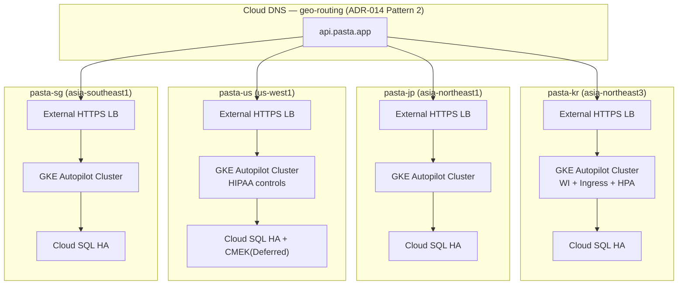
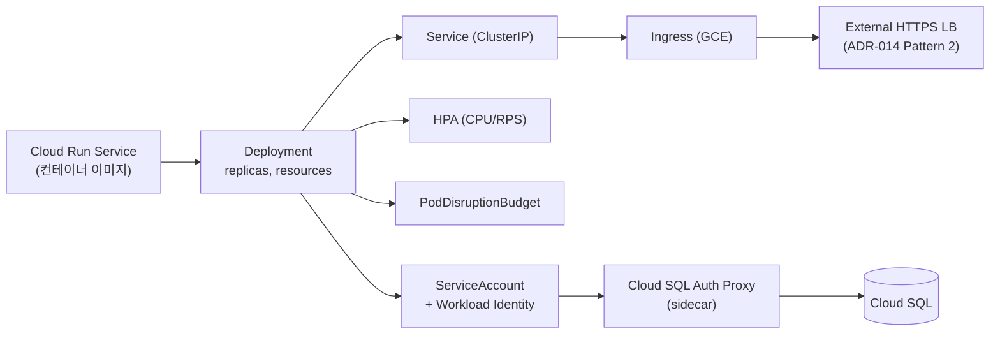

# pasta 글로벌 확장 — GKE 즉시 도입(Day 1) 시나리오 검토

- **작성일**: 2026-05-12
- **버전**: v0.3 보조 문서 (ADR-001 대안 분석)
- **작성**: slicequeue (+ `gcp-infra-architect v1.2` 에이전트 파트너)
- **관련**: [ADR-001](adr/ADR-001-compute-strategy.md), [ADR-013](adr/ADR-013-project-partitioning-strategy.md), [ADR-014](adr/ADR-014-load-balancer-pattern.md), [ROADMAP-EFFORT.md](ROADMAP-EFFORT.md)
- **성격**: 결정 문서가 **아님**. ADR-001 원안(Cloud Run 유지)을 뒤집을 정당성이 있는지 사전 검토용

---

## 0. TL;DR

> **GKE 즉시 도입은 일정 +4~8개월·인력 +1~2명을 강제한다. Kafka가 확정되지 않은 현 시점에서는 ADR-001 원안(Cloud Run 유지, Phase 3 재평가)이 합리적. 즉시 도입은 §7 체크리스트 3개 이상 충족 시에만 ADR-015로 정식 검토 권고.**

---

## 1. 도입 배경 — 왜 다시 논의되는가

ADR-001은 **Cloud Run 유지 + Phase 3 하이브리드 GKE Autopilot**으로 결정됐다. 그럼에도 GKE 즉시 도입(Day 1)이 재논의되는 트리거는 다음 4가지로 정리된다.

1. **Kafka 도입 시점 불확실성** — Phase 3에 맞춰 들어온다는 보장이 없다. 1년 내 확정될 가능성이 있다면 GKE를 먼저 깔아두는 편이 통합 비용을 줄인다는 논리
2. **WebSocket·gRPC·Stateful 워크로드 증가 가능성** — 보이스 기능(WebSocket)이 이미 존재. 동시 연결이 1000+로 늘면 Cloud Run의 인스턴스 모델이 부적합해질 수 있음
3. **Cloud Run 안정성 통증** — [CONTEXT.md §8](CONTEXT.md) 기록: "AWS ECS처럼 안정적이지 않은 느낌, DB 연결 이슈 반복". 플랫폼 자체 문제로 보는 시각
4. **4개국 운영 표준화 욕구** — 인프라팀이 K8s 도메인 지식을 이미 보유. 글로벌 확장을 계기로 도메인을 통일하자는 제안

**판정 기준**: 위 4개 중 **확정·임박**한 트리거가 몇 개인가? 현 시점 확정된 것은 0개. 모두 "가능성"이다.

---

## 2. GKE 즉시 도입 시 구조

### 2.1 클러스터 토폴로지 (ADR-013 Option B와 결합)

ADR-013 시장별 GCP 프로젝트 구조 위에 시장별 GKE 클러스터를 얹는다.

### 2.2 Autopilot vs Standard

| 기준 | Autopilot | Standard |
|---|---|---|
| 노드 관리 | Google 책임 | 직접 관리 |
| 학습 곡선 | 낮음 (1명 운영 가능 영역) | 높음 |
| 유연성 | 제한적 (privileged·DaemonSet 일부 X) | 자유 |
| 비용 | pod 단위 청구 | 노드 단위 |
| **권고** | **1명+a 인력에서 강력 권고** | 인프라팀 풀타임 시에만 |

→ 본 검토는 **Autopilot 전제**. Standard는 인력 가정상 비현실적.

### 2.3 워크로드 이관 매핑

Cloud Run 48개 서비스를 GKE로 옮기는 기본 매핑.

**핵심 변경점**:
- **Cloud SQL 연결**: Cloud Run 자동 연결 → Workload Identity + Auth Proxy **sidecar 패턴**
- **스케일링**: scale-to-zero → **min replica ≥ 1** (Autopilot도 0 불가)
- **배포**: gcloud run deploy → **Helm 차트 또는 Kustomize + ArgoCD**
- **시크릿**: Cloud Run env → External Secrets Operator + Secret Manager
- **로그·메트릭**: 자동 → Managed Prometheus + Cloud Operations (Operator 설치 필요)

---

## 3. Cloud Run 유지안 vs GKE 즉시 도입 비교

| 항목 | Cloud Run 유지 | GKE Autopilot Day 1 |
|---|---|---|
| **학습 곡선 (slicequeue)** | 낮음 (현 운영 경험) | **높음** — K8s 자원 모델·Helm·HPA·NetworkPolicy 신규 |
| **운영 부담 (1명 기준)** | 낮음 | 중~높음 — 클러스터 업그레이드·CRD·Operator 관리 |
| **scale-to-zero** | 가능 (idle 비용 0) | 불가 — Autopilot도 최소 1 pod 유지 |
| **Stateful·WebSocket·gRPC** | 제한적 (timeout·sticky 제약) | 자유 — StatefulSet·Headless Service |
| **Kafka 도입 친화도** | 외부 의존 (Confluent Cloud 등) | 클러스터 내 Strimzi/Confluent Operator 가능 |
| **4개국 일관성** | 좋음 (서비스별 region 설정) | 매우 좋음 (manifests 동일) |
| **헬스케어 컴플라이언스** | 충분 — Google-managed 영역 넓음 | 충분 — 단 CMEK 본 v0.3는 Deferred (ADR-006) |
| **비용 (수십 RPS 기준)** | 낮음 — 사용량 과금 | **중간** — idle pod·LB·Cloud Ops 고정비 |
| **인프라팀 의존도** | 낮음 — slicequeue 단독 가능 영역 다수 | **높음** — K8s 책임자 풀타임 차출 필수 |
| **장애 시 디버깅** | 로그·메트릭 중심 | kubectl·Operator·CRD 분석까지 확장 |
| **이관 자체 작업** | 없음 | **48개 서비스 재배포 + 검증** |

**핵심 차이는 3가지로 압축된다**:
1. **48개 서비스 이관 자체가 새로운 프로젝트** — Cloud Run 유지안에는 없는 항목
2. **인프라팀 K8s 책임자 풀타임 차출 강제** — 현재는 부분 지원 전제
3. **scale-to-zero 손실 + idle 비용 발생** — 운영 비용 구조 변화

---

## 4. 작업 분해 — 누가 얼마나 (Person-Week)

ADR-001 원안 대비 **추가**되는 작업만 정리.

| Phase | 작업 | 담당 | PW | 비고 |
|---|---|---|---|---|
| Phase 0 | Autopilot vs Standard 결정 + ADR-015 신설 | slicequeue + 인프라팀 | 1 | |
| Phase 0 | 인프라팀 K8s 책임자 **풀타임 차출 합의** | 매니저 + 인프라팀 리드 | 0 (협의) | **크리티컬 — 안 되면 전체 무효** |
| Phase 1 | GKE Autopilot 클러스터 TF 모듈 (4시장) | 인프라팀 + slicequeue 페어 | 3 | |
| Phase 1 | Workload Identity + Cloud SQL Auth Proxy sidecar 패턴 | 인프라팀 | 2 | |
| Phase 1 | Artifact Registry 이미지 빌드·푸시 파이프라인 | slicequeue | 2 | |
| Phase 1 | Helm/Kustomize 표준 차트 작성 | slicequeue + 인프라팀 | 3 | |
| Phase 1 | 옵저버빌리티 (Managed Prometheus + Cloud Ops) | 인프라팀 | 2 | |
| Phase 2 | **시범 서비스 1개 이관** (Cloud Run → GKE) | slicequeue + 인프라팀 | 3 | 패턴 검증 |
| Phase 2 | 나머지 47개 서비스 점진 이관 | 코어팀 3인 + slicequeue | **15~25** | **가장 큰 변수** |
| Phase 2 | Ingress + LB Pattern 2 통합 | 인프라팀 | 2 | |
| Phase 2 | 신규 리전(미·싱) GKE 클러스터 구축 | 인프라팀 | 4 | |
| Phase 3 | HPA·VPA·PDB 튜닝 | slicequeue + 인프라팀 | 3 | |
| Phase 3 | 비용 최적화 (Committed Use, Spot Pool) | 인프라팀 | 2 | |
| Phase 3 | 4개국 dry-run + 운영 핸드오버 | 전원 | 3 | |

**합계 ~45~55 PW 추가** (Cloud Run 유지 대비). [ROADMAP-EFFORT.md](ROADMAP-EFFORT.md) §2 합계 64 PW에 더해지면 **총 110~120 PW**.

---

## 5. Cloud Run 유지안 대비 차이

### 5.1 일정

| 시나리오 | Cloud Run 유지 | GKE Day 1 | 차이 |
|---|---|---|---|
| Best (9개월) | 9개월 | **15~17개월** | +6~8개월 |
| Realistic (12~14개월) | 12~14개월 | **18~22개월** | +4~8개월 |
| MVP-Lite 5개월 | 가능 (조건부) | **불가능** | — |
| MVP 9개월 | 빠듯 | **불가능** | — |

### 5.2 비용 구조

- **단기**: Cloud Run idle 비용 ≈ 0 → GKE Autopilot은 최소 pod·LB·Cloud Ops로 **시장당 월 고정비 발생** (정밀 견적은 본 문서 범위 밖)
- **장기**: GKE 표준화로 Committed Use·Spot Pool 활용 시 최적화 여지 있음 — 단 Phase 3 이후
- **숨은 비용**: 인프라팀 풀타임 차출 = 다른 프로젝트 기회비용

### 5.3 인력

| 항목 | Cloud Run | GKE Day 1 |
|---|---|---|
| slicequeue 부담 | 풀스택 운영 | + K8s 학습 부담 |
| 인프라팀 K8s 책임자 | 단발성 지원 | **풀타임 차출** |
| 외주 컨설턴트 | 5개월 시나리오만 | **GKE 경험자 별도 필요** |
| 코어팀 3인 | 부분 지원 | 47개 서비스 이관에 집중 투입 |

### 5.4 리스크

- **K8s 책임자 이탈 SPOF** — 현재 인프라팀에 책임자 1명. 이탈 시 프로젝트 정지급 영향
- **48개 서비스 이관 중 장애** — 시범 1개 검증 후에도 패턴별 함정 (DB 연결·헬스체크·graceful shutdown) 가능성
- **비용 예측 어려움** — idle pod 누적·LB 다중화로 월 비용이 예상 ±50%
- **Cloud Run 통증 원인 오진 가능성** — 플랫폼 문제가 아니라 DB 연결 패턴이라면 GKE로 옮겨도 재발

---

## 6. 권고

**권고 1 — 즉시 도입 비권고**

ADR-001 원안 유지가 합리적. 사유:

- 1명+a 인력으로 K8s 학습 + 48서비스 이관 + 신규 리전 동시 진행은 일정·품질 양쪽 리스크
- Cloud Run 안정성 통증은 [ADR-001 후속 작업](adr/ADR-001-compute-strategy.md)의 **Managed Connection Pooling + Auth Proxy Sidecar + `min_instances=1`**로 상당 부분 해결 가능 (GKE 없이도)
- Kafka 도입이 확정되지 않은 상태에서 "GKE를 위한 GKE"는 과잉 투자

**권고 2 — Phase 3 재평가 유지**

[ADR-001 검증 포인트](adr/ADR-001-compute-strategy.md)에 따라 Phase 3 진입 시점(2027-01 전후)에:
- Kafka 도입 확정 여부
- WebSocket 동시 연결 1000+ 초과 여부
- Cloud Run 통증의 근본 원인 (플랫폼 vs 연결 패턴) 판명 결과

위 3개를 재확인하고 하이브리드 도입 여부 결정.

**권고 3 — 조건부 즉시 도입 추진안**

사업·기술 요구로 즉시 도입이 불가피하면 **다음 3개를 동시에** 확보해야 진행 가능:

1. 인프라팀 K8s 책임자 **풀타임 차출 합의서**
2. **외주 GKE 컨설턴트 1명, 6개월** 예산 확보
3. 일정 **+6개월 이상 수용** (또는 미국 단독 MVP를 9개월로 확장)

3개 중 하나라도 빠지면 추진하지 말 것.

---

## 7. 즉시 도입 정당화 체크리스트

다음 7개 중 **3개 이상** 충족 시에만 ADR-015 신설로 정식 재검토.

- [ ] Kafka·Pulsar 도입 **확정** (1년 내 운영 시작)
- [ ] WebSocket·gRPC 장기 연결 워크로드 비중 **30%+**
- [ ] Stateful 서비스 다수 도입 예정 (Redis Cluster·Elasticsearch·자체 호스팅 메시지 큐)
- [ ] 인프라팀 K8s 책임자 **풀타임 차출 합의 완료**
- [ ] 외주 GKE 컨설턴트 예산 확보 (2~3명·6개월급)
- [ ] 일정 **18~22개월 수용** 가능 (또는 미국 단독 MVP를 9개월로 확장 수용)
- [ ] Cloud Run 안정성 사고가 **사업 직접 영향** (고객 이탈·계약 손실 사례 발생)

**현 시점 충족 개수: 0개** (모두 가능성·미확정). 따라서 즉시 도입 트리거 없음.

---

## 8. 확인된 것 vs 가정한 것

### 확인된 것

- 현재 Cloud Run 한+일 48개 서비스 운영 ([CONTEXT.md §6](CONTEXT.md))
- 인프라팀에 K8s 책임자 + 실무자 보유, 단 글로벌 확장 풀타임 X
- slicequeue 인프라 전담 X, K8s 경험 부족
- ADR-001 원안: Cloud Run 유지 + Phase 3 하이브리드
- Terraform 0건 (green-field)
- Kafka 도입 시점 미확정

### 가정한 것 (재평가 트리거 동반)

| 가정 | 재평가 트리거 |
|---|---|
| GKE Autopilot은 1명 운영 가능 영역 — 단 4개국 분리 운영 시 다름 | 실제 시범 서비스 1개 운영 후 손가락 비용 측정 |
| 48개 서비스 점진 이관 PW 15~25 — 서비스 복잡도에 따라 ±50% 오차 | 시범 서비스 1개 이관 PW 실측 시 재산정 |
| 외주 GKE 컨설턴트 시장가·섭외 가능성 | 영업 채널 확인 시 갱신 |
| Cloud Run 안정성 통증의 근본 원인 = 연결 패턴 (플랫폼 아님) | Phase 0 완화책 적용 후 1주 메트릭 측정 |
| GKE Autopilot idle 고정비 < Cloud Run scale-to-zero 절약 | 실제 트래픽 패턴 측정 후 비교 |
| Helm 차트 표준화 3 PW로 충분 | 첫 차트 작성 시 실측 |

---

## 9. 다음 액션

1. **§7 체크리스트 7개에 대해 사업·기술 의사결정자와 확인** (slicequeue + 매니저 + 인프라팀 리드)
2. **3개 이상 충족 시**:
   - ADR-015 (Compute Strategy v2 / GKE Day 1) 신설 작업 착수
   - [ROADMAP-EFFORT.md](ROADMAP-EFFORT.md) 일정 재산출 (+4~8개월)
   - 외주 컨설턴트 섭외 + 인프라팀 차출 합의 병렬 진행
3. **미충족 시 (현 시점 default)**:
   - ADR-001 원안 그대로 유지
   - Phase 0 Cloud Run 완화책에 집중 → 통증 근본 원인 판명
   - Phase 3 진입 전 본 문서 §7 체크리스트 재실행

---

## 10. 내일 매니저에게 보고할 1줄

> **"GKE 즉시 도입은 일정 +4~8개월·인력 +1~2명을 강제하는데, Kafka 도입 확정·인프라팀 풀타임 차출 등 정당화 트리거가 현재 0개라 ADR-001 원안(Cloud Run 유지 + Phase 3 재평가)을 유지 권고. 7개 트리거 중 3개 이상 충족되면 ADR-015로 정식 재검토하겠음."**

---

## 참고

- [ADR-001 컴퓨트 전략 원안](adr/ADR-001-compute-strategy.md)
- [ADR-013 프로젝트 분할](adr/ADR-013-project-partitioning-strategy.md) — 시장별 프로젝트 → 시장별 클러스터 매핑 근거
- [ADR-014 LB 패턴](adr/ADR-014-load-balancer-pattern.md) — Pattern 2와 GKE Ingress 결합
- [ROADMAP-EFFORT.md](ROADMAP-EFFORT.md) — Cloud Run 유지안 기준 견적
- [CONTEXT.md §8](CONTEXT.md) — Cloud Run 안정성 통증 기록
- [GKE Autopilot overview](https://docs.cloud.google.com/kubernetes-engine/docs/concepts/autopilot-overview)
- [Workload Identity 가이드](https://docs.cloud.google.com/kubernetes-engine/docs/concepts/workload-identity)
- [Cloud SQL Auth Proxy sidecar 패턴](https://docs.cloud.google.com/sql/docs/mysql/connect-auth-proxy)
