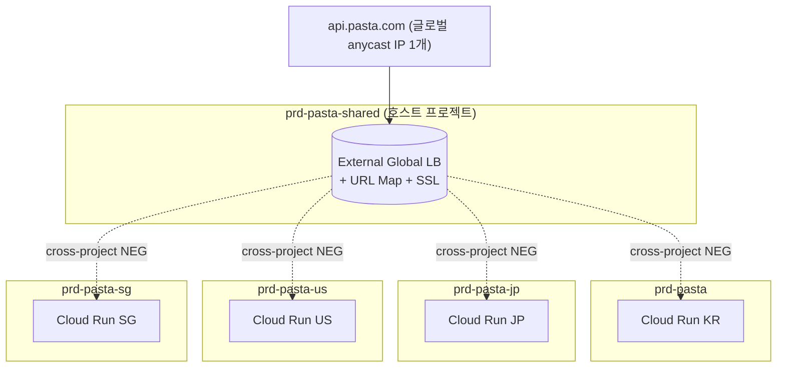
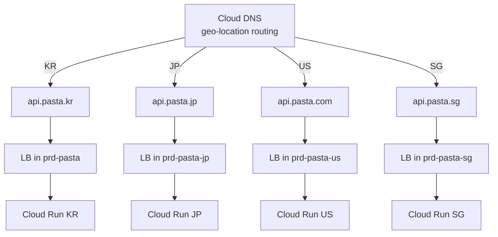

# ADR-014: 로드밸런서 패턴 — 시장별 LB + DNS Geo-routing (Pattern 2 Default)

- **상태**: Proposed (v0.3 신설)
- **작성일**: 2026-05-08
- **리뷰어**: 인프라팀 / 보안 / 법무 / 백엔드 리드
- **관련**: ADR-003 (리전), ADR-004 (레지던시), ADR-013 (프로젝트 분할)

---

## 컨텍스트

ADR-013에서 **시장(국가)별 GCP 프로젝트** 분할을 채택했다. 이 구조에서 **사용자 트래픽이 어떤 로드밸런서를 통해 어떤 시장 프로젝트의 백엔드로 라우팅되는지**, **로드밸런서가 어느 프로젝트에 위치하는지**가 별도 결정이 필요하다.

### GCP External Global Application LB의 작동 원리 (1차 자료)

- **External Global Application LB는 "프로젝트 단위 리소스"**. `프로젝트/forwarding-rule`, `프로젝트/url-map`, `프로젝트/backend-service`처럼 한 프로젝트에 묶임 — 자체 떠 있는 게 아님
- **글로벌 anycast IP** 1개. 한국 사용자는 서울 PoP, 미국 사용자는 LA PoP으로 진입. IP는 하나, 진입점은 전 세계 분산
- **백엔드 cross-project 연결**:
  1. **Shared VPC** — 호스트 프로젝트(LB)와 서비스 프로젝트(Cloud Run)가 VPC 공유
  2. **Cross-project Serverless NEG referencing** — IAM 권한 기반 참조 (2024년 GA, 2026 시점 구현 전 GCP 최신 문서 재확인 필요)

(참조: [Resource Hierarchy](https://cloud.google.com/resource-manager/docs/cloud-platform-resource-hierarchy), [External HTTP(S) LB overview](https://cloud.google.com/load-balancing/docs/https))

---

## 결정할 사항

- (1) **호스트 프로젝트(`prd-pasta-shared`)에 글로벌 LB 하나** + cross-project 백엔드 참조 = **Pattern 1**
- (2) **시장별 프로젝트에 각각 regional/global LB** + DNS geo-routing = **Pattern 2** ⭐

---

## 고려한 옵션

### Pattern 1: 호스트 프로젝트 글로벌 LB + Cross-Project 백엔드



**장점**:
- 단일 도메인(`api.pasta.com`) — 글로벌 브랜드 일관성
- SSL 인증서 1개 (Google-managed)
- URL Map 한 곳에서 path·헤더·지리 라우팅 통합

**단점**:
- ❌ **헬스케어 컨텍스트에서 호스트 프로젝트가 트래픽 통과** → 한국 개보법·일본 3省2ガイドライン 해석상 **호스트 프로젝트도 "수탁자"가 될 수 있음**. BAA·위탁계약 추가 가능성 (법무 컨펌 필요)
- LB 자체 장애 = 전 시장 영향 (격리 약함)
- Shared VPC 또는 cross-project NEG 설정 전제 — 운영 부담 증가
- ADR-013(프로젝트 = 규제 경계) 원칙과 모순될 소지

### Pattern 2: 시장별 LB + DNS Geo-routing ⭐ 권고



**장점**:
- ✅ **각 시장 내부 완결** — 헬스케어 데이터 흐름이 시장 프로젝트 안에서만. **호스트 프로젝트 트래픽 통과 해석 문제 회피**
- ✅ **장애 격리** — 시장별 LB 장애가 타 시장에 영향 X
- ✅ **ADR-013 원칙 일관성** — "프로젝트 = 규제 경계"가 LB 레이어에서도 유지
- ✅ Shared VPC / cross-project NEG 전제 불필요 — 운영 단순
- ✅ 시장별 인증서·DNS·WAF 정책 독립

**단점**:
- 국가별 도메인 분리 (`api.pasta.kr`, `api.pasta.com`, `api.pasta.jp`, `api.pasta.sg`)
- LB 4개 비용 (단, Cloud Run regional LB는 비용 저렴)
- SSL 인증서 4개 관리 (Google-managed로 자동화)
- DNS geo-routing 설정 필요 (Cloud DNS Routing Policy)

---

## 결정

> **선택: Pattern 2 (시장별 LB + DNS Geo-routing) — Default**
>
> **Pattern 1은 향후 옵션으로 보류** (글로벌 SaaS 확장·단일 도메인 사업 요건 발생 시 재평가)

### 선택 근거

1. **헬스케어 규제 안전성** — 호스트 프로젝트 트래픽 통과 시 "수탁자" 해석 리스크 회피. 데이터 흐름이 시장 내부에서 완결
2. **ADR-013 원칙 일관성** — 프로젝트 = 규제 경계 = LB 경계. 일관된 설계
3. **장애 격리** — 시장별 완전 격리
4. **운영 단순성** — Shared VPC·cross-project NEG 학습 곡선 회피
5. **MVP 가속** — 5개월 압축 시나리오에서 미국 only 시작 시, 미국 LB 하나만 세우면 됨 (호스트 프로젝트 설계 불필요)

### 수용한 트레이드오프

- 국가별 도메인 분리 — 글로벌 단일 브랜드 마케팅 시 제약 (사업팀 합의 필요)
- LB 4개 운영 — Terraform 모듈화로 반복 부담 완화
- DNS geo-routing 학습 — Cloud DNS Routing Policy 한 번 익히면 재사용

---

## 도메인 전략 (제안)

| 시장 | 도메인 | 비고 |
|------|-------|------|
| 한국 | `api.pasta.kr` 또는 `api.pasta.co.kr` | 기존 운영 도메인 유지 |
| 일본 | `api.pasta.jp` | 기존 운영 도메인 유지 |
| 미국 | `api.pasta.com` | 신규 / 글로벌 대표 도메인 후보 |
| 싱가포르 | `api.pasta.sg` | 신규 |

→ Phase 0에서 사업·마케팅팀과 도메인 전략 합의 필요.

### DNS Geo-routing 동작 (Cloud DNS)

```
api.pasta.com (글로벌 기본)
  ├── geo: ASIA → api.pasta.kr or api.pasta.jp or api.pasta.sg (사용자 위치 기반)
  └── geo: AMERICAS → api.pasta.com (us-west1 LB)
```

또는 **국가별 도메인을 사용자가 직접 선택**(브랜드 페이지에서 국가 선택) — geo-routing 없이 정적 매핑.

---

## Terraform 디렉토리 (ADR-005 보정 반영)

```
infra/terraform/
├── shared/                          # prd-pasta-shared (옵션, Pattern 1용)
│   ├── global-lb/                   # Pattern 2 채택 시 사용 X (또는 미사용)
│   ├── org-policies/
│   └── tfstate-buckets/
└── markets/
    ├── kr/                          # prd-pasta
    │   ├── cloud-run/
    │   ├── cloudsql/
    │   ├── loadbalancer/            # Pattern 2: 시장별 LB
    │   └── dns/
    ├── jp/                          # prd-pasta-jp
    ├── us/                          # prd-pasta-us
    └── sg/                          # prd-pasta-sg
```

→ ADR-005의 `shared/global-lb/`는 Pattern 1 전제로 작성된 것. **Pattern 2 채택 시 `markets/*/loadbalancer/`로 분산** (ADR-005 Amendment 필요).

---

## Pattern 1 재평가 트리거

향후 다음 조건 발생 시 Pattern 1 재평가:

1. **글로벌 단일 브랜드 + 단일 도메인** 사업 요건 확정 (`api.pasta.com` 하나로 전 세계)
2. **글로벌 SaaS / B2B 통합 인증** 필요 (단일 SSO 진입점)
3. **법무 컨펌**: 호스트 프로젝트 트래픽 통과가 "수탁자"로 해석되지 않음을 확인
4. **운영 성숙도**: Shared VPC / cross-project NEG 운영 경험 축적

---

## 결과

### 긍정적
- 헬스케어 규제 안전 (시장 내부 완결)
- ADR-013 일관성 유지
- 장애 격리 완전
- MVP 압축 시나리오에 친화적

### 부정적 / 감수
- 국가별 도메인 분리 (브랜드 일관성 제약)
- LB 4개 운영 부담 (모듈화로 완화)
- SSL 인증서 4개 (Google-managed 자동화)

### 후속 작업

- [ ] Phase 0: 사업·마케팅팀과 도메인 전략 합의 (`pasta.com` vs 국가별 도메인)
- [ ] Phase 0: Cloud DNS geo-routing vs 정적 매핑 결정
- [ ] Phase 1: ADR-005 디렉토리 보정 (`markets/*/loadbalancer/` 추가)
- [ ] Phase 1: Terraform 모듈 `modules/loadbalancer-regional/` 작성
- [ ] Phase 2: 신규 시장(미·싱) LB·DNS 구축
- [ ] Phase 3: 도메인·인증서 통합 운영 가이드 작성

---

## 리스크 & 완화

| 리스크 | 가능성 | 영향 | 완화 |
|--------|-------|------|------|
| 국가별 도메인이 마케팅 일관성에 부적합 | M | M | Phase 0 사업팀 합의 / 필요 시 Pattern 1 재평가 |
| LB 4개 설정 drift | M | M | Terraform 모듈 + CI plan 검증 |
| DNS geo-routing 오설정 (잘못된 시장으로 라우팅) | L | H | Phase 2 dry-run 테스트 + 모니터링 |
| SSL 인증서 만료 누락 | L | M | Google-managed cert 자동 갱신 + 알림 |
| Cross-region latency (글로벌 사용자가 가까운 시장 못 찾을 때) | L | M | DNS geo-routing fallback 정책 |

---

## 검증 포인트

- [ ] Phase 1: 한국 LB가 한국 외 사용자에게 응답 안 함 (geo-routing 격리)
- [ ] Phase 2: 4개 시장 LB 모두 P95 latency <100ms (자국 사용자)
- [ ] Phase 2: SSL Labs A+ 등급 4개 도메인 모두
- [ ] Phase 2: 4개국 dry-run에서 데이터가 시장 외부로 흐르지 않음 증빙

---

## 재평가 시점

- **Phase 1 종료** — 사업팀 도메인 전략 합의 결과
- **글로벌 단일 도메인 사업 요건 발생 시** — Pattern 1 재평가
- **5번째 시장 추가 시** — LB·DNS 운영 부담 누적 점검

---

## 참고

- ADR-013 (프로젝트 분할) — 결정 짝
- ADR-005 (Terraform) — 디렉토리 보정 필요
- [Cloud DNS Routing Policy](https://cloud.google.com/dns/docs/policies-overview)
- [Cloud Load Balancing — Cross-project services](https://cloud.google.com/load-balancing/docs/https/setting-up-https-cross-project-backend)
