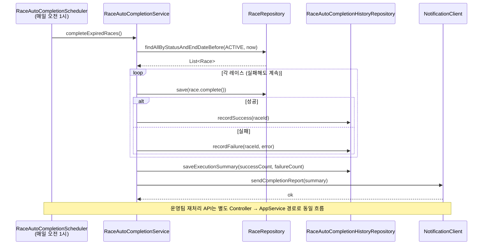
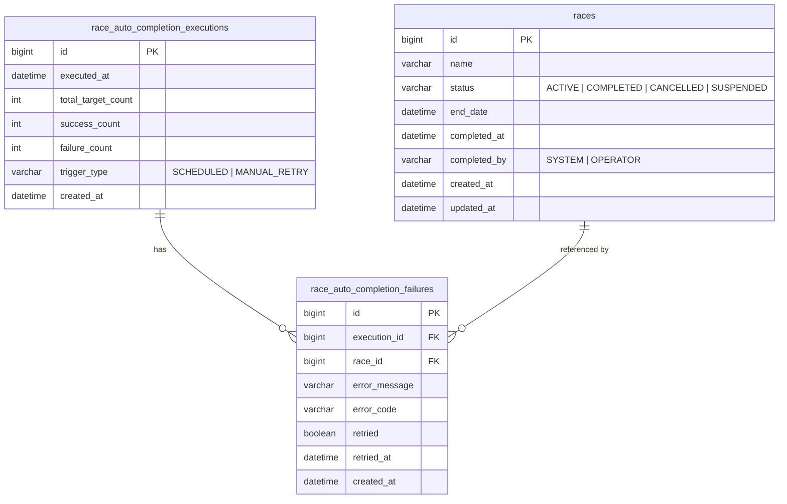

# 레이스 자동 완료 TDD (Technical Design Document)

## 메타

| 항목 | 내용 |
|------|------|
| 연관 PRD | `docs/prd/race-auto-completion-prd.md` |
| 복잡도 | 복합 (배치 + 다중 도메인 + 이력 관리) |
| 작성일 | 2026-04-09 |

---

## 1. 개요

### 구현 목표 (기술 관점)

종료일이 경과한 "진행 중" 레이스를 매일 정해진 시각(기본 오전 1시)에 자동으로 "완료" 상태로 전환한다.
Spring Scheduler로 트리거하고, 개별 레이스 처리 실패가 전체를 중단시키지 않도록 방어 로직을 구현한다.
처리 이력은 DB에 저장하고, 운영팀 알림(Slack/Email)을 발송하며, 실패 건 재처리 API를 제공한다.

### 변경 범위

| 레이어 | 모듈 | 변경 내용 |
|--------|------|-----------|
| Domain | race | `RaceStatus` 상태 전환 메서드, `RaceAutoCompletionHistory` 엔티티 |
| Application | race | `RaceAutoCompletionService`, `RaceAutoCompletionHistoryService` |
| Infrastructure | race | `RaceAutoCompletionScheduler`, `RaceAutoCompletionHistoryRepository`, `NotificationClient` |
| Web | race | `RaceAutoCompletionHistoryController` (운영팀 이력 조회 + 재처리 API) |
| DB | race | `race_auto_completion_histories` 테이블, `race_auto_completion_history_failures` 테이블 |

---

## 2. 시스템 아키텍처



### 레이어 의존성

```
Controller → ApplicationService → DomainService / Repository Interface
                                              ↑
                              Infrastructure (JPA, Scheduler, NotificationClient)
```

---

## 3. 데이터베이스 설계

### ERD



### 신규 테이블 명세

#### `race_auto_completion_executions`

| 컬럼 | 타입 | 제약 | 설명 |
|------|------|------|------|
| `id` | BIGINT | PK AUTO_INCREMENT | 실행 ID |
| `executed_at` | DATETIME(6) | NOT NULL | 실행 시각 |
| `total_target_count` | INT | NOT NULL DEFAULT 0 | 처리 대상 수 |
| `success_count` | INT | NOT NULL DEFAULT 0 | 성공 건수 |
| `failure_count` | INT | NOT NULL DEFAULT 0 | 실패 건수 |
| `trigger_type` | VARCHAR(20) | NOT NULL | SCHEDULED / MANUAL_RETRY |
| `created_at` | DATETIME(6) | NOT NULL | 생성 시각 |

인덱스: `idx_executed_at` on `executed_at` (이력 날짜 검색용, 90일 보존)

#### `race_auto_completion_failures`

| 컬럼 | 타입 | 제약 | 설명 |
|------|------|------|------|
| `id` | BIGINT | PK AUTO_INCREMENT | 실패 기록 ID |
| `execution_id` | BIGINT | NOT NULL FK | 실행 ID |
| `race_id` | BIGINT | NOT NULL FK | 실패한 레이스 ID |
| `error_message` | TEXT | | 오류 메시지 |
| `error_code` | VARCHAR(100) | | 오류 코드 |
| `retried` | TINYINT(1) | NOT NULL DEFAULT 0 | 재처리 여부 |
| `retried_at` | DATETIME(6) | | 재처리 시각 |
| `created_at` | DATETIME(6) | NOT NULL | 생성 시각 |

인덱스: `idx_race_id` on `race_id`, `idx_retried` on `retried`

### 마이그레이션 파일

`V202604090100__add_race_auto_completion_tables.sql`

### `races` 테이블 변경

기존 `races` 테이블에 컬럼 추가:
- `completed_at DATETIME(6)`: 완료 시각 (자동/수동 모두)
- `completed_by VARCHAR(20)`: 완료 주체 (`SYSTEM` / `OPERATOR`)

마이그레이션: `V202604090101__add_completed_columns_to_races.sql`

---

## 4. API 명세

### 운영팀 이력 조회

```
GET /internal/races/auto-completion/executions
Authorization: ROLE_OPERATOR

Query Parameters:
  - date: yyyy-MM-dd (특정 날짜)
  - raceName: String (레이스 이름 검색)
  - page: int (default: 0)
  - size: int (default: 20)

Response 200:
{
  "content": [
    {
      "executionId": 1,
      "executedAt": "2026-04-09T01:00:00",
      "totalTargetCount": 50,
      "successCount": 48,
      "failureCount": 2,
      "triggerType": "SCHEDULED",
      "failures": [
        {
          "failureId": 10,
          "raceId": 123,
          "raceName": "레이스명",
          "errorMessage": "...",
          "retried": false
        }
      ]
    }
  ],
  "totalElements": 100,
  "page": 0,
  "size": 20
}
```

### 실패 건 재처리

```
POST /internal/races/auto-completion/failures/{failureId}/retry
Authorization: ROLE_OPERATOR

Response 200:
{
  "failureId": 10,
  "raceId": 123,
  "retried": true,
  "retriedAt": "2026-04-09T10:30:00",
  "result": "SUCCESS"
}

Response 409 (이미 재처리된 경우):
{
  "code": "ALREADY_RETRIED",
  "message": "이미 재처리된 실패 건입니다."
}
```

---

## 5. 알고리즘 및 비즈니스 로직

### 자동 완료 처리 흐름

```
1. findAllByStatusAndEndDateBefore(ACTIVE, now()) 로 대상 레이스 전건 조회
2. execution 기록 생성 (started)
3. 각 레이스에 대해:
   a. race.complete(completedAt, "SYSTEM") 호출
   b. raceRepository.save(race)
   c. 성공 → successCount++
   d. 실패 (Exception) → failureCount++, failure 기록
   e. 다음 레이스 계속 (중단 없음)
4. execution 기록 업데이트 (successCount, failureCount)
5. notificationClient.sendReport(execution)
```

### 레이스 상태 전환 규칙 (도메인)

- `complete()` 메서드는 `ACTIVE` 상태에서만 호출 가능
- `COMPLETED`, `CANCELLED`, `SUSPENDED` 상태에서 호출 시 `InvalidRaceStatusException` 발생
- FR-2 준수: 진행 중(ACTIVE)인 레이스만 처리

### 재처리 로직

```
1. failureId로 RaceAutoCompletionFailure 조회
2. retried == true이면 AlreadyRetriedException 발생
3. 해당 race를 findById로 조회
4. race.complete() 시도
5. 성공 시 failure.markRetried(now) 저장
6. 실패 시 failure 업데이트 없이 예외 반환
```

---

## 6. 인터페이스 정의

### NotificationClient (외부 알림)

```java
// com.example.race.infrastructure.notification.NotificationClient
public interface NotificationClient {
    void sendAutoCompletionReport(AutoCompletionReportPayload payload);
}

// Slack 구현체
// com.example.race.infrastructure.notification.SlackNotificationClient
public class SlackNotificationClient implements NotificationClient { ... }
```

환경변수 4곳 등록 필요:
- `application.yml` (local)
- `application-dev.yml`
- `application-prod.yml`
- Kubernetes Secret / AWS Parameter Store (운영)

---

## 7. 아키텍처 적합성 분석

| 항목 | 판단 | 비고 |
|------|------|------|
| 레이어 의존성 방향 | 준수 | Controller → Service → Repository |
| 트랜잭션 경계 | 레이스 1건 단위로 분리 | 개별 실패 시 전체 롤백 방지 |
| 스케줄러 중복 실행 방지 | 필요 | ShedLock 또는 @ConditionalOnProperty |
| 이력 보존 90일 | 필요 | 배치 삭제 또는 파티셔닝 전략 별도 검토 |
| 운영 권한 시큐리티 | 필요 | `/internal/**` 경로 `ROLE_OPERATOR` 등록 |
| 알림 실패가 완료 처리를 막지 않아야 함 | 주의 | NotificationClient 호출을 try-catch로 감싸 완료 처리와 분리 |

### 우려 지점

**우려 1: 스케줄러 다중 인스턴스 중복 실행**

여러 서버 인스턴스가 동시에 스케줄러를 실행하면 동일 레이스가 중복 처리될 수 있다.
→ 대안: `ShedLock` 도입 (DB 기반 분산 락) 또는 배치 전용 인스턴스 1개 지정.

**우려 2: 대량 처리 시 메모리 부하**

현재 전건 조회 방식은 건수가 수천 건으로 늘어나면 OOM 위험이 있다.
→ 대안: `Pageable`로 청크(Chunk, 한 번에 처리할 묶음) 단위 처리, 기본 청크 크기 100.

---

## 8. 구현 단계 (Phases)

### 구현 워크플로

#### 사전 준비
1. 작업 브랜치 생성: `api/feat/race-auto-completion`

#### Phase 실행 (에이전트 1회 호출로 전체 구현)
1. Phase 1~4 코드를 **한번에 구현**
2. 전체 구현 완료 후 **테스트 실행** (`./gradlew :race:test`)
3. 테스트 실패 시 자체 수정·재실행 (5회 미만). **5회 이상 실패 시 중단, 보고**
4. 테스트 통과 후 반환

#### 커밋·체크 (메인 컨텍스트)
1. Phase별 관련 파일을 나눠 **개별 커밋**
2. 각 커밋 후 TDD의 `- [ ]`를 `- [x]`로 업데이트
3. 전체 완료 후 PR 생성 여부 확인

---

### Phase 1: 도메인 모델 확장

**목표**: `Race` 상태 전환 메서드, `RaceAutoCompletionExecution` / `RaceAutoCompletionFailure` 도메인 엔티티 정의

**TODO**:
- [ ] `com.example.race.domain.Race.complete(LocalDateTime completedAt, String completedBy)` 메서드 추가
- [ ] `com.example.race.domain.Race` — `ACTIVE` 이외 상태에서 `complete()` 호출 시 `InvalidRaceStatusException` throw
- [ ] `com.example.race.domain.RaceAutoCompletionExecution` 도메인 엔티티 생성 (id, executedAt, totalTargetCount, successCount, failureCount, triggerType)
- [ ] `com.example.race.domain.RaceAutoCompletionFailure` 도메인 엔티티 생성 (id, execution, raceId, errorMessage, retried, retriedAt)
- [ ] `com.example.race.domain.RaceAutoCompletionFailure.markRetried(LocalDateTime retriedAt)` 메서드 추가
- [ ] `com.example.race.domain.exception.InvalidRaceStatusException` 예외 클래스 생성

**테스트**: Domain 계층 — 순수 JUnit 5, Fake 객체, DB 불필요

```
RaceCompleteTest:
  - complete_성공_ACTIVE상태에서만_완료가능
  - complete_실패_COMPLETED상태에서_InvalidRaceStatusException
  - complete_실패_CANCELLED상태에서_InvalidRaceStatusException
  - complete_실패_SUSPENDED상태에서_InvalidRaceStatusException

RaceAutoCompletionFailureTest:
  - markRetried_성공_retriedTrue로_변경되고_retriedAt설정됨
  - markRetried_실패_이미재처리된경우_AlreadyRetriedExceptionThrow
```

**커밋 계획**:
- `feat: Race 도메인 자동 완료 메서드 및 이력 엔티티 추가`

**커밋 대상 파일**:
- `src/main/java/com/example/race/domain/Race.java`
- `src/main/java/com/example/race/domain/RaceAutoCompletionExecution.java`
- `src/main/java/com/example/race/domain/RaceAutoCompletionFailure.java`
- `src/main/java/com/example/race/domain/exception/InvalidRaceStatusException.java`
- `src/test/java/com/example/race/domain/RaceCompleteTest.java`
- `src/test/java/com/example/race/domain/RaceAutoCompletionFailureTest.java`

---

### Phase 2: DB 마이그레이션 + Repository + JPA 엔티티

**목표**: 신규 테이블 생성, JPA 엔티티, Repository 구현

**TODO**:
- [ ] `src/main/resources/db/migration/V202604090100__add_race_auto_completion_tables.sql` 생성
- [ ] `src/main/resources/db/migration/V202604090101__add_completed_columns_to_races.sql` 생성
- [ ] `com.example.race.infrastructure.jpa.RaceAutoCompletionExecutionJpaEntity` 생성 (`@Entity`)
- [ ] `com.example.race.infrastructure.jpa.RaceAutoCompletionFailureJpaEntity` 생성 (`@Entity`)
- [ ] `com.example.race.infrastructure.jpa.RaceAutoCompletionExecutionJpaRepository` 생성 (`JpaRepository`)
- [ ] `com.example.race.infrastructure.jpa.RaceAutoCompletionFailureJpaRepository` 생성 (JpaRepository + 커스텀 쿼리)
- [ ] `com.example.race.infrastructure.RaceAutoCompletionExecutionRepositoryImpl` — Repository 인터페이스 구현
- [ ] `com.example.race.infrastructure.RaceAutoCompletionFailureRepositoryImpl` — Repository 인터페이스 구현
- [ ] `com.example.race.domain.repository.RaceAutoCompletionExecutionRepository` 인터페이스 정의
- [ ] `com.example.race.domain.repository.RaceAutoCompletionFailureRepository` 인터페이스 정의

**테스트**: Infrastructure 계층 — `@DataJpaTest` + **Testcontainers (MySQL 필수, H2 금지)**

```
RaceAutoCompletionExecutionRepositoryTest (@DataJpaTest + Testcontainers MySQL):
  - save_성공_실행이력_저장됨
  - findByExecutedAtBetween_날짜범위_조회됨
  - findByExecutedAtBetween_90일이전_이력_미조회
  - findFailuresByExecutionId_실패목록_조회됨

RaceAutoCompletionFailureRepositoryTest (@DataJpaTest + Testcontainers MySQL):
  - save_성공_실패기록_저장됨
  - findByRaceId_레이스ID로_실패기록_조회됨
  - findByRetried_false_미재처리건만_조회됨
  - updateRetried_재처리완료_상태_업데이트됨
```

**커밋 계획**:
- `feat: 레이스 자동 완료 DB 마이그레이션 및 Repository 구현`

**커밋 대상 파일**:
- `src/main/resources/db/migration/V202604090100__add_race_auto_completion_tables.sql`
- `src/main/resources/db/migration/V202604090101__add_completed_columns_to_races.sql`
- `src/main/java/com/example/race/infrastructure/jpa/RaceAutoCompletionExecutionJpaEntity.java`
- `src/main/java/com/example/race/infrastructure/jpa/RaceAutoCompletionFailureJpaEntity.java`
- `src/main/java/com/example/race/infrastructure/jpa/RaceAutoCompletionExecutionJpaRepository.java`
- `src/main/java/com/example/race/infrastructure/jpa/RaceAutoCompletionFailureJpaRepository.java`
- `src/main/java/com/example/race/domain/repository/RaceAutoCompletionExecutionRepository.java`
- `src/main/java/com/example/race/domain/repository/RaceAutoCompletionFailureRepository.java`
- `src/main/java/com/example/race/infrastructure/RaceAutoCompletionExecutionRepositoryImpl.java`
- `src/main/java/com/example/race/infrastructure/RaceAutoCompletionFailureRepositoryImpl.java`
- `src/test/java/com/example/race/infrastructure/RaceAutoCompletionExecutionRepositoryTest.java`
- `src/test/java/com/example/race/infrastructure/RaceAutoCompletionFailureRepositoryTest.java`

---

### Phase 3: Application Service + Scheduler

**목표**: 자동 완료 서비스 로직, 재처리 서비스, 스케줄러 구현

**TODO**:
- [ ] `com.example.race.application.RaceAutoCompletionService.completeExpiredRaces()` 구현
  - `raceRepository.findAllByStatusAndEndDateBefore(ACTIVE, now)` 호출
  - 건별 try-catch 처리 (실패해도 다음 건 계속)
  - `execution` 저장 및 알림 발송
- [ ] `com.example.race.application.RaceAutoCompletionService.retryFailure(Long failureId)` 구현
- [ ] `com.example.race.infrastructure.scheduler.RaceAutoCompletionScheduler` 구현
  - `@Scheduled(cron = "${race.auto-completion.cron:0 0 1 * * *}")` 적용
- [ ] `com.example.race.infrastructure.notification.NotificationClient` 인터페이스 정의
- [ ] `com.example.race.infrastructure.notification.SlackNotificationClient` 구현
- [ ] `application.yml` — `race.auto-completion.cron` 환경변수 4곳 등록

**테스트**: Application 계층 — Mockito

```
RaceAutoCompletionServiceTest (Mockito):
  - completeExpiredRaces_성공_모든레이스_완료처리됨
  - completeExpiredRaces_일부실패_실패건_기록되고_나머지_계속처리됨
  - completeExpiredRaces_대상없음_실행이력만_기록됨
  - completeExpiredRaces_알림실패_완료처리에_영향없음
  - retryFailure_성공_레이스완료_및_retriedAt_설정됨
  - retryFailure_실패_이미재처리된경우_AlreadyRetriedExceptionThrow
  - retryFailure_실패_레이스가ACTIVE아닌경우_InvalidRaceStatusException
```

**커밋 계획**:
- `feat: 레이스 자동 완료 서비스 및 스케줄러 구현`

**커밋 대상 파일**:
- `src/main/java/com/example/race/application/RaceAutoCompletionService.java`
- `src/main/java/com/example/race/infrastructure/scheduler/RaceAutoCompletionScheduler.java`
- `src/main/java/com/example/race/infrastructure/notification/NotificationClient.java`
- `src/main/java/com/example/race/infrastructure/notification/SlackNotificationClient.java`
- `src/main/resources/application.yml`
- `src/test/java/com/example/race/application/RaceAutoCompletionServiceTest.java`

---

### Phase 4: Web Layer (운영팀 API)

**목표**: 이력 조회 API, 재처리 API Controller 구현 및 시큐리티 경로 등록

**TODO**:
- [ ] `com.example.race.web.RaceAutoCompletionHistoryController` 생성
  - `GET /internal/races/auto-completion/executions` — 이력 목록 조회
  - `POST /internal/races/auto-completion/failures/{failureId}/retry` — 재처리
- [ ] `com.example.race.web.dto.AutoCompletionExecutionResponse` record 생성
- [ ] `com.example.race.web.dto.AutoCompletionFailureResponse` record 생성
- [ ] `com.example.race.web.dto.RetryFailureResponse` record 생성
- [ ] **시큐리티 경로 등록**: `/internal/races/auto-completion/**` → `ROLE_OPERATOR` 필수 (NFR-5)

**테스트**: Web 계층 — `@WebMvcTest` + MockMvc

```
RaceAutoCompletionHistoryControllerTest (@WebMvcTest):
  - getExecutions_성공_200_이력목록_반환
  - getExecutions_날짜필터_적용_조회됨
  - getExecutions_인증없음_401_반환
  - getExecutions_OPERATOR아닌권한_403_반환
  - retryFailure_성공_200_재처리결과_반환
  - retryFailure_이미재처리됨_409_반환
  - retryFailure_존재하지않는failureId_404_반환
```

**커밋 계획**:
- `feat: 레이스 자동 완료 이력 조회 및 재처리 API 구현`
- `feat: 레이스 자동 완료 API 시큐리티 경로 등록`

**커밋 대상 파일**:
- `src/main/java/com/example/race/web/RaceAutoCompletionHistoryController.java`
- `src/main/java/com/example/race/web/dto/AutoCompletionExecutionResponse.java`
- `src/main/java/com/example/race/web/dto/AutoCompletionFailureResponse.java`
- `src/main/java/com/example/race/web/dto/RetryFailureResponse.java`
- `src/main/java/com/example/race/config/SecurityConfig.java` (경로 추가)
- `src/test/java/com/example/race/web/RaceAutoCompletionHistoryControllerTest.java`

---

## 9. 테스트 전략

> **H2 사용 금지** — Infrastructure 계층 테스트는 반드시 Testcontainers(MySQL)를 사용한다.
> H2는 MySQL과 SQL 방언, 인덱스 동작, 트랜잭션 격리 수준이 달라 실제 환경과 다른 결과를 낼 수 있어 신뢰할 수 없는 테스트가 된다.

### 계층별 테스트 전략

| 계층 | 방식 | 도구 | DB 필요 | 속도 |
|------|------|------|---------|------|
| Domain | 순수 단위 테스트 | JUnit 5 + Fake | 없음 | 밀리초 |
| Application | 모킹 기반 단위 테스트 | JUnit 5 + Mockito | 없음 (Mock) | 밀리초 |
| Infrastructure | 슬라이스 테스트 | @DataJpaTest + Testcontainers MySQL | MySQL (컨테이너) | 초 단위 |
| Web | 슬라이스 테스트 | @WebMvcTest + MockMvc | 없음 (Mock) | 밀리초 |

### Testcontainers 설정

```java
// src/test/java/com/example/race/infrastructure/MySQLTestContainerConfig.java
@TestConfiguration
public class MySQLTestContainerConfig {

    @Container
    static MySQLContainer<?> mysql = new MySQLContainer<>("mysql:8.0")
        .withReuse(true); // CI 컨테이너 재사용으로 초기화 비용 최소화

    @DynamicPropertySource
    static void overrideProps(DynamicPropertyRegistry registry) {
        registry.add("spring.datasource.url", mysql::getJdbcUrl);
        registry.add("spring.datasource.username", mysql::getUsername);
        registry.add("spring.datasource.password", mysql::getPassword);
    }
}
```

### 주요 테스트 시나리오

| ID | 시나리오 | 계층 | 유형 |
|----|----------|------|------|
| T-1 | 종료일 경과 ACTIVE 레이스 전건 완료 처리 | Application | Happy Path |
| T-2 | 일부 레이스 처리 실패 시 나머지 계속 처리 | Application | Edge Case |
| T-3 | 처리 대상 없을 때 빈 이력 기록 | Application | Edge Case |
| T-4 | 알림 발송 실패해도 완료 처리에 영향 없음 | Application | Edge Case |
| T-5 | 이미 COMPLETED인 레이스는 대상에서 제외됨 | Domain | Happy Path |
| T-6 | 실패 건 재처리 성공 시 즉시 COMPLETED 전환 | Application | Happy Path |
| T-7 | 이미 재처리된 실패 건에 재처리 시도 시 409 | Web | Negative |
| T-8 | 운영팀 권한 없는 사용자 API 접근 시 403 | Web | Negative |
| T-9 | 이력 조회 날짜 필터 적용 시 정확한 결과 반환 | Infrastructure | Happy Path |
| T-10 | 90일 이전 이력 조회 미포함 검증 | Infrastructure | Edge Case |

### 속도 개선 전략

- Domain / Application 테스트: DB 없이 밀리초 단위 실행 → H2 없이도 충분히 빠름
- Infrastructure 테스트: `withReuse(true)` 설정으로 CI에서 컨테이너 재사용, 초기화 비용 1회만 발생
- `@DataJpaTest`로 JPA 슬라이스만 로드, 전체 Spring Context 불필요
