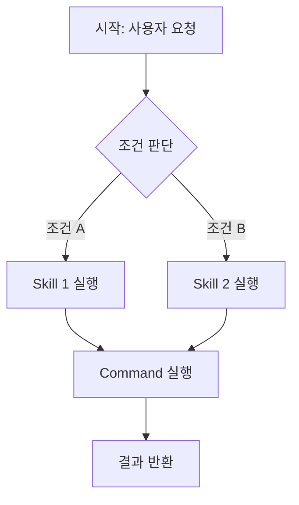

# Skill Chain Blueprint

스킬체인은 여러 스킬/커맨드를 순차 또는 조건부로 엮은 워크플로다.

## 디렉토리 구조

```
anvil/skill-chains/{chain-name}/
├── CHAIN.md                # 체인 정의 (흐름도 + 분기 조건)
└── references/             # 선택
```

## CHAIN.md 템플릿

```markdown
---
name: {chain-name}
description: "{한 줄 설명}"
components:
  - type: {skill|command|agent}
    name: {component-name}
    role: "{이 체인에서의 역할}"
  - type: ...
    name: ...
    role: ...
---

# {chain-name} - {워크플로 제목}

## 목적
{이 체인이 해결하는 전체 문제}

## 흐름도



## 단계별 정의

### Step 1: {단계명}
- **실행 컴포넌트**: `anvil/skills/{name}` or `anvil/commands/{name}`
- **입력**: {이전 단계의 출력 or 사용자 입력}
- **출력**: {다음 단계로 전달할 내용}
- **분기 조건**: {있으면 기술}

### Step 2: {단계명}
...

## 에러 처리

| 실패 지점 | 처리 방식 |
|-----------|-----------|
| Step N 실패 | {재시도 / 스킵 / 중단 후 보고} |

## 가드레일

- {체인 전체에 적용되는 제약}
```

## 설계 원칙

- **각 Step은 독립 테스트 가능** — 체인 전체가 아닌 개별 스텝도 단독 실행 가능해야 함
- **데이터 흐름 명시** — Step 간 전달되는 데이터 형태를 명확히 정의
- **실패 격리** — 한 Step 실패가 전체 체인을 무조건 중단시키지 않도록 에러 처리 정의
